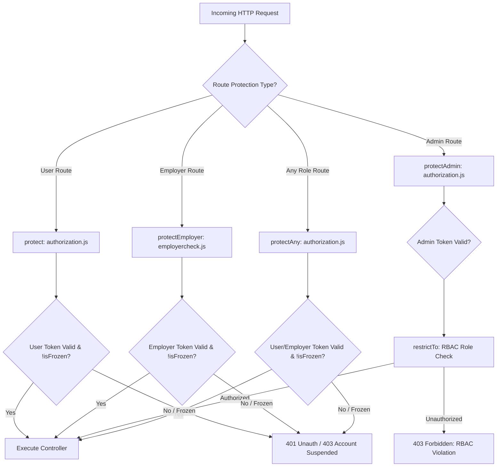
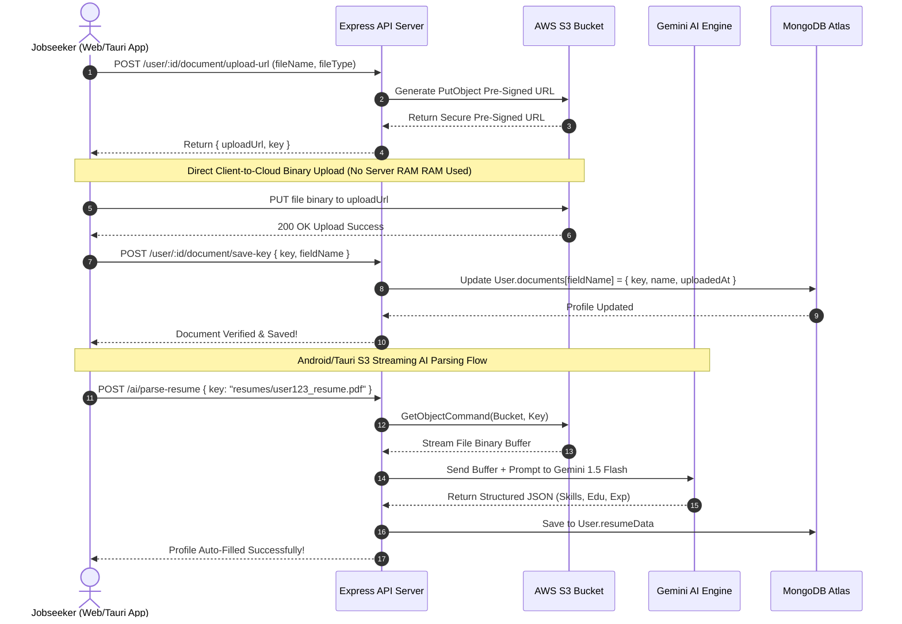
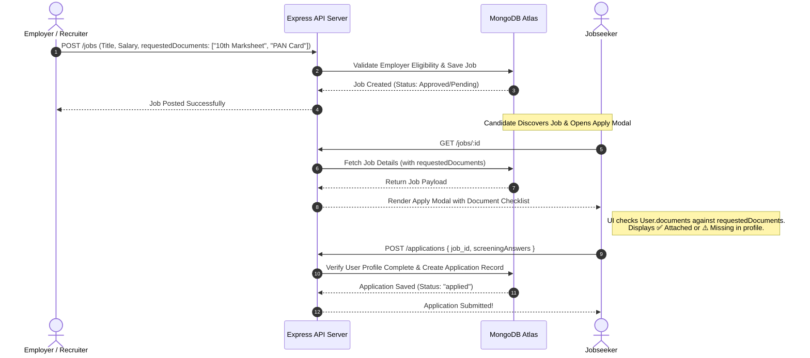
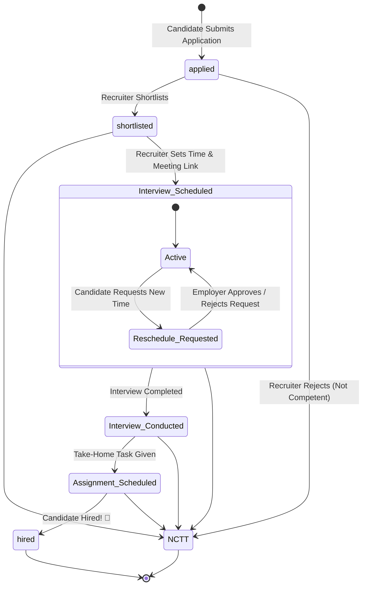
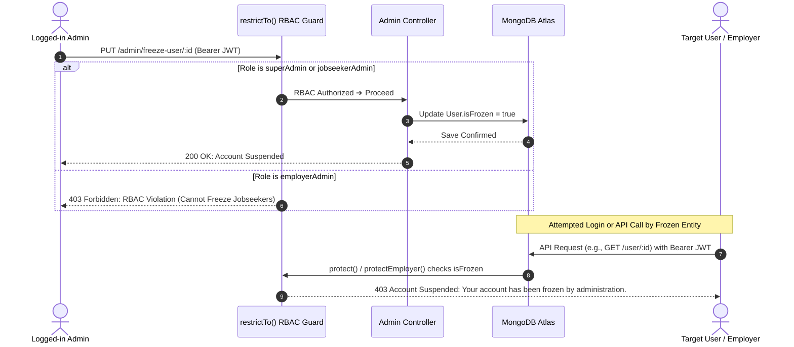
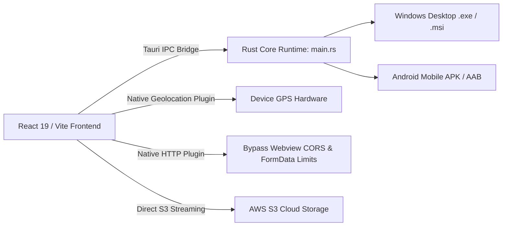
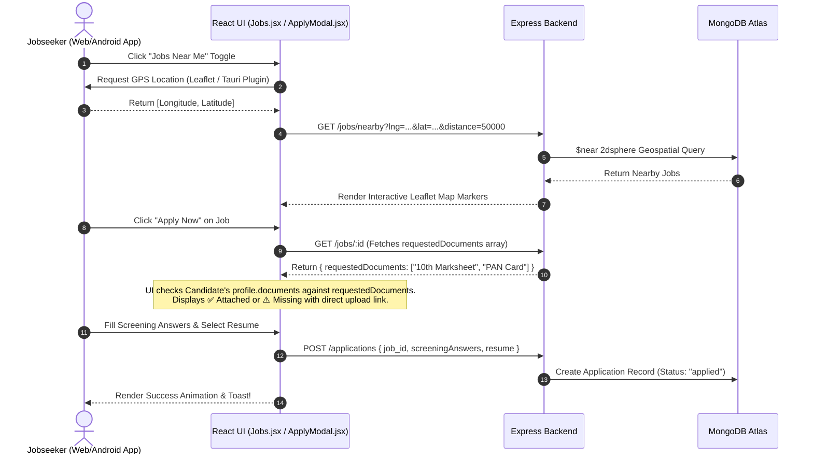
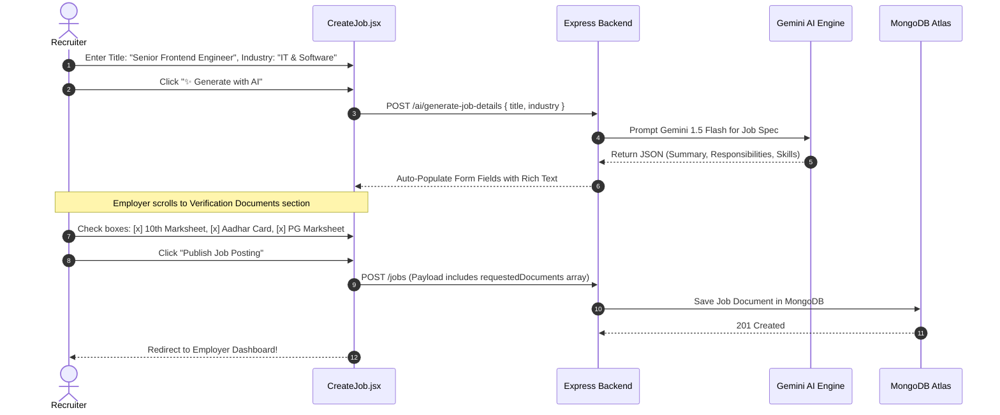
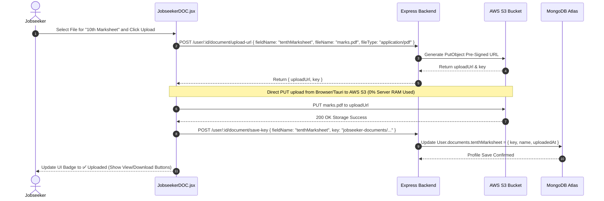
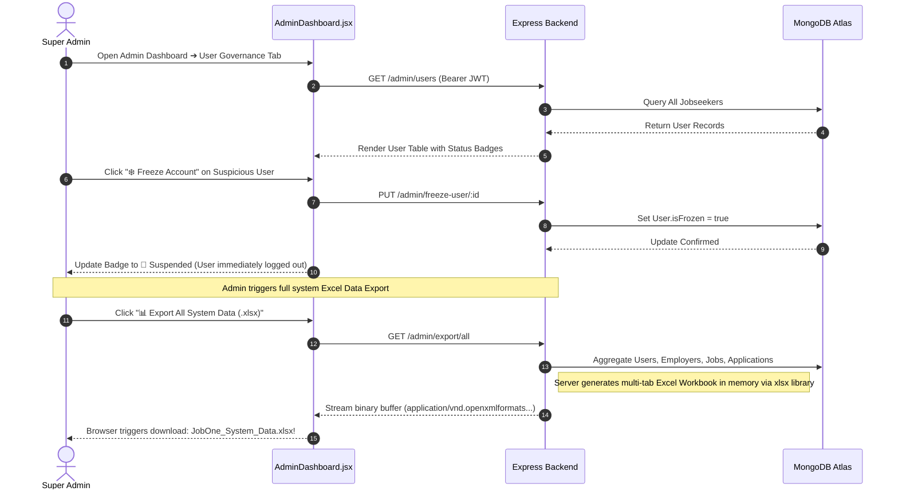

# 🏆 JobOne ATS — Final Production Master Technical & Architectural Documentation

Welcome to the **Master Production Documentation** for **JobOne ATS** (Applicant Tracking System). This exhaustive, unified document represents the complete, production-grade specification of the entire JobOne ecosystem—combining both the deep backend server architecture (Part 1) and the modern client-side frontend, desktop, and mobile application infrastructure (Part 2).

---

# 🌐 PART 1: BACKEND ARCHITECTURE & TECHNICAL DOCUMENTATION

Welcome to the definitive backend documentation for **JobOne ATS** (Applicant Tracking System). This section provides an exhaustive, production-grade architectural breakdown of the backend ecosystem, covering every directory, file, database model, API router, controller logic, middleware guard, external integration, and end-to-end logical workflow.

---

## 📖 1.1 Executive Summary & System Overview

JobOne ATS is a modern, full-stack recruitment and talent acquisition platform designed to bridge the gap between jobseekers and employers through intelligent automation, rigorous verification, and seamless communication. 

The backend is engineered using **Node.js** and **Express.js**, adhering to a modular, scalable **Model-View-Controller (MVC)** architectural pattern. It features multi-tiered Role-Based Access Control (RBAC), geospatial job matching, AI-powered resume parsing and job recommendations, AWS S3 cloud storage streaming, Brevo SMTP transactional email delivery, and Excel-based system reporting.

---

## 🛠️ 1.2 Technology Stack & Key Dependencies

| Technology / Library | Version | Architecture Role |
| :--- | :--- | :--- |
| **Node.js / Express.js** | `^5.1.0` | Core asynchronous HTTP REST API server framework. |
| **MongoDB / Mongoose** | `^8.18.2` | NoSQL database ODM with strict schema validation and GIS indexing. |
| **JSON Web Token (JWT)** | `^9.0.2` | Stateless, cryptographic bearer token authentication and session management. |
| **Bcrypt** | `^6.0.0` | 10-round salted password hashing for user, employer, and admin credentials. |
| **AWS SDK S3** | `^3.932.0` | Cloud object storage client and pre-signed URL generator for secure file transfers. |
| **Google Generative AI / AI SDK** | `^0.24.1` / `^3.0.75` | Gemini LLM integration for resume parsing, job description generation, and AI chatbot. |
| **Brevo (Axios SMTP API)** | `^1.13.2` | Transactional email delivery engine for OTP verification and platform alerts. |
| **Multer / PDF-Parse / Mammoth** | `^2.1.1` | In-memory multipart file handling, PDF extraction, and DOCX document processing. |
| **XLSX / Archiver** | `^0.18.5` | Dynamic Excel spreadsheet data export and ZIP archiving for Super Admins. |
| **Express-Validator / Zod** | `^7.3.0` / `^4.4.3` | Rigorous API request body validation and runtime type checking. |

---

## 📁 1.3 Complete Backend Directory & File Structure

```text
c:\AdoreJob1\backend\
├── configs/
│   └── db.js                        # MongoDB Mongoose connection pool & initialization
├── controllers/
│   ├── adminControllers.js          # Super Admin RBAC, review workflows, freezing & Excel exports
│   ├── aiChatControllers.js         # AI Chatbot conversational assistant endpoints
│   ├── aiControllers.js             # Gemini AI resume parsing (Buffer & S3 stream), job gen & recommendations
│   ├── applicationControllers.js    # 7-stage application lifecycle & interview reschedule workflows
│   ├── contactControllers.js        # Contact Us support ticket ingestion & retrieval
│   ├── employerControllers.js       # Employer onboarding, eligibility, S3 docs, candidate search & profile
│   ├── imageControllers.js          # Dynamic local image asset server
│   ├── jobsControllers.js           # Job CRUD, GIS nearby search, similar jobs & employer metrics
│   └── userControllers.js           # Jobseeker auth, profile, S3 resumes, and 9 optional verification docs
├── middleware/
│   ├── auditlogger.js               # User and employer action logging middleware
│   ├── authorization.js             # JWT bearer verification, operational freeze check, RBAC restrictTo & protectAny
│   ├── constants.js                 # Global HTTP status code constants
│   ├── employercheck.js             # Employer-specific JWT verification and account freeze guard
│   └── errorhandler.js              # Centralized Express error interceptor and JSON formatter
├── models/
│   ├── activity.js                  # Audit trail schema for user/employer actions
│   ├── admin.js                     # Admin credentials with strict RBAC enum (superAdmin, employerAdmin, jobseekerAdmin)
│   ├── applications.js              # Application tracking schema with 7 statuses, screening answers & rescheduling
│   ├── contacted.js                 # Support ticket schema (feedback, complaint, suggestion, inquiry)
│   ├── employer.js                  # Employer profile, business verification docs, GIS location & ratings
│   ├── jobs.js                      # Job posting schema with 9 industry enums, GIS location & requested documents
│   ├── users.js                     # Jobseeker profile, 9 optional verification docs, AI resume data & portfolios
│   ├── userVerification.js          # OTP verification record table for jobseekers
│   └── verification.js              # OTP verification record table for employers
├── routes/
│   ├── adminRoutes.js               # Protected REST routes for admin governance & exports
│   ├── aiRoutes.js                  # Protected REST routes for AI parsing, generation, and chatbot
│   ├── applicationRoutes.js         # REST routes for submitting and managing job applications
│   ├── contactRoutes.js             # REST routes for support contact inquiries
│   ├── employerRoutes.js            # REST routes for employer authentication, profiles, and candidate search
│   ├── imageRoutes.js               # REST route for serving static/dynamic images
│   ├── jobsRoutes.js                # REST routes for job discovery, filtering, and employer metrics
│   └── userRoutes.js                # REST routes for jobseeker auth, profiles, and document management
├── scripts/
│   └── createSuperAdmin.js          # CLI script to seed initial Super Admin credentials in MongoDB
├── utils/
│   ├── activitytrigger.js           # Helper utility for emitting user activity audit events
│   ├── emailVerification.js         # HTML email template generator for OTP verification
│   └── sendEmail.js                 # Axios-based Brevo SMTP REST API transmitter
├── .env                             # Environment variables (DB URI, JWT Secret, Brevo API, AWS S3 keys)
├── check_user.js                    # CLI diagnostic tool for verifying user account state
├── index.js                         # Application entry point, CORS configuration, route mounting & server listen
├── unfreeze_user.js                 # CLI utility for emergency account unfreezing
└── package.json                     # Project dependency manifests and npm scripts
```

---

## 🗄️ 1.4 Database Schema & Data Models (`/models`)

The data layer is built on MongoDB using Mongoose ODM, utilizing strict schema validation, references (`ObjectId`), and geospatial indices.

### `users.js` (Jobseeker Model)
*   **Core Identity**: `name`, `email` (unique), `password` (hashed), `phone` (unique, sparse), `gender`, `isVerified`, `isProfileComplete`.
*   **Verification Documents (`documents` object)**: Supports 9 optional verification document records, each containing an AWS S3 `key`, file `name`, and `uploadedAt` timestamp:
    *   `tenthMarksheet`, `twelfthMarksheet`, `ugMarksheet`, `pgMarksheet`
    *   `aadharCard`, `panCard`, `medicalCertificate`, `salarySlips` (for experienced candidates), `otherDocuments`
*   **Professional Credentials**: `skills` (Array of strings), `portfolioLinks` (`platform`, `url`), `experience` (linked to `Job` or custom company/role), `projects` (`title`, `technologies`, `link`, `description`), `certifications` (`name`, `issuer`, `date`), `volunteering`.
*   **AI Parsed Data (`resumeData`)**: Embedded object caching AI-extracted details (`name`, `phone`, `description`, `skills`, `projects`, `certifications`, `experience`, `education`) to enable instant profile autofill.
*   **Legacy & S3 Resume**: `resume` (legacy URL), `resumeFileKey` (AWS S3 object key), `resumeOriginalName`.
*   **Governance & Activity**: `isFrozen` (boolean toggle preventing platform access), `createdJobs`, `appliedJobs`, timestamps.

### `employer.js` (Employer Model)
*   **Core Identity**: `name`, `email` (unique), `password`, `phone`, `companyName`, `companyWebsite`, `description`, `profilePicture`.
*   **Business Classification**: `employerType` (`company` vs `individual`), `natureOfBusiness` (`Proprietorship`, `Partnership`, `Trust/NGO`, `Public LTD`, `Private LTD`, `LLP`, `ERP`).
*   **Geospatial Location (`officeLocation`)**: GeoJSON point schema (`type: 'Point'`, `coordinates: [longitude, latitude]`, `address`) enabling location-based candidate search.
*   **Verification Documents**: S3 keys for `aadharCard`, `panCard`, `gstForm`, `otherBusinessCertificate`, `tradeLicense`, `educationDocuments`.
*   **Governance & Status**: `isVerified`, `isApproved` (`pending`, `approved`, `rejected`), `isFrozen`, `ratingsReceived` (embedded review schema with 1-5 star ratings and reviewer IDs).

### `jobs.js` (Job Posting Model)
*   **Job Classification**: `title`, `industry` (Strict enum: `"IT & Software"`, `"Banking & Finance"`, `"Sales & Marketing"`, `"Healthcare & Pharma"`, `"Engineering & Manufacturing"`, `"Operations & Logistics"`, `"Customer Support"`, `"HR & Admin"`, `"Education & EdTech"`), `subdomain`.
*   **Job Details**: `jobSummary`, `keyResponsibilities`, `jobFeatures`, `jobType` (Array: `"permanent"`, `"internship"`, `"full-time"`, `"freelance"`, etc.), `workDaysPattern` (`Mon to Fri`, `Custom`, etc.).
*   **Geospatial Location**: `location` GeoJSON index (`2dsphere`) for "Jobs Near Me" queries, `pinCode`.
*   **Compensation & Perks**: `salaryMin`, `salaryMax`, `salaryCurrency` (`INR`), `salaryFrequency` (`Month`, `Year`, `Lump-Sum`, etc.), `incentives` (Array).
*   **Applicant Screening & Verification Requirements**:
    *   `screeningQuestions`: Array of custom questions candidates must answer during application.
    *   `requestedDocuments`: Array of document names (e.g., `["10th Marksheet", "Aadhar Card", "PAN Card"]`) specifically requested by the employer for this role.
*   **Duration & Scheduling**: `durationType`, `startDate`, `endDate`, `isFlexibleDuration`, `applicationDeadline`, `shifts` (Array of shift names and start/end times).

### `applications.js` (Application Lifecycle Model)
*   **Relational Links**: `job_id` (ref: `Job`), `jobHost` (ref: `Employer`), `appliedBy` (ref: `User`).
*   **Lifecycle Status**: Strict state machine enum:
    *   `applied` ➔ `shortlisted` ➔ `Interview Scheduled` ➔ `Interview Conducted` ➔ `Assignment Scheduled` ➔ `hired` / `NCTT` (Not Competent At This Time).
*   **Screening & Communication**: `screeningAnswers` (Array of `{ question, answer }`), `applicantHasSeen`, `employerMessage`, `meetingLink`, `applicantMessage`.
*   **Interview Reschedule Workflow (`rescheduleRequest`)**: Embedded object tracking candidate reschedule requests (`isRequested`, `reason`, `proposedTime`, `requestStatus`: `"pending"` | `"approved"` | `"rejected"` | `"none"`).

### `admin.js` (RBAC Administration Model)
*   **Identity & Credentials**: `name`, `email` (unique), `password` (hashed via Mongoose `pre('save')` hook).
*   **Strict RBAC Role Enum**:
    *   `superAdmin`: Unrestricted platform access, can manage other admins, export system-wide data, and override all settings.
    *   `employerAdmin`: Restricted to reviewing, approving, auditing, and freezing employers and job postings.
    *   `jobseekerAdmin`: Restricted to reviewing, auditing, and freezing jobseeker accounts and applications.

### Additional Auxiliary Models
*   **`contacted.js`**: Ingests user/employer support inquiries (`communicationType`: `feedback`, `complaint`, `suggestion`, `inquiry`, `isRead` toggle).
*   **`activity.js`**: Audit trail logging actions (`apply`, `message`, `viewProfile`, `login`) linked to user and target IDs.
*   **`userVerification.js` / `verification.js`**: Short-lived OTP verification tables with email binding and expiration timestamps.

---

## 🔐 1.5 Middleware Layer (`/middleware`)

The middleware layer acts as the security and operational gatekeeper for all HTTP requests entering the Express application.



1.  **`authorization.js`**:
    *   **`protect`**: Extracts Bearer JWT, decodes user ID, verifies user existence in MongoDB, and enforces the **Operational Freeze Guard** (`if (req.user.isFrozen) return 403 Account Suspended`).
    *   **`protectAdmin`**: Verifies admin JWT token and attaches `req.admin`.
    *   **`restrictTo(...roles)`**: Higher-order RBAC middleware. Checks if `req.admin.role` is included in the allowed roles array; rejects with `403 Forbidden` if unauthorized.
    *   **`protectAny`**: Dual-entity authentication guard. Attempts to resolve the JWT against `User` first, and if not found, checks `Employer`. Protects shared endpoints (e.g., viewing public profiles or resumes) while enforcing freeze locks on both entity types.
2.  **`employercheck.js` (`protectEmployer`)**:
    *   Dedicated verification for employer routes. Decodes `req.employerId`, verifies against MongoDB, and strictly blocks frozen employers from posting jobs or accessing applicant pools.
3.  **`errorhandler.js`**:
    *   Centralized Express error interceptor mounted at the end of `index.js`. Captures unhandled exceptions, Mongoose validation errors, and custom API faults, returning standardized JSON payloads (`{ message, stack }` in development).
4.  **`auditlogger.js`**:
    *   Intercepts requests to log user and employer activities into the `Activity` collection for security auditing and platform analytics.

---

## 🛣️ 1.6 API Routing Layer (`/routes`)

All endpoints are prefixed and mounted in `index.js` with comprehensive CORS support.

| Route Module | Base Path | Key Endpoints & Responsibilities |
| :--- | :--- | :--- |
| **`userRoutes.js`** | `/user` | `POST /register`, `POST /login`, `POST /verifyotp`, `POST /google-login`, `PATCH /:id` (profile update), `POST /:id/resume/upload-url`, `POST /:id/document/upload-url`, `GET /:id/document/download`. |
| **`employerRoutes.js`** | `/employer` | `POST /register`, `POST /login`, `POST /updateProfile`, `GET /profile/:id`, `GET /explore`, `POST /generate-upload-url`, `PATCH /save-document-key`, `GET /my-candidates`. |
| **`jobsRoutes.js`** | `/jobs` | `POST /` (create job), `GET /` (list/filter jobs), `GET /nearby` (GIS search), `GET /category-counts`, `GET /employer-jobs`, `GET /:id/applicants`, `PATCH /:id`. |
| **`applicationRoutes.js`** | `/applications` | `POST /` (apply), `GET /:id` (user apps), `GET /job/:jobId` (employer applicants), `PATCH /:id/status` (7-stage update), `POST /:id/reschedule` (reschedule request). |
| **`adminRoutes.js`** | `/admin` | `POST /login`, `POST /create-admin` (Super Admin only), `GET /employers/pending`, `PATCH /employers/:id/review`, `PUT /freeze-user/:id`, `GET /export/all`. |
| **`aiRoutes.js`** | `/ai` | `POST /parse-resume` (Buffer/S3 stream), `POST /generate-job-details`, `GET /recommend-jobs`, `POST /chat` (Gemini chatbot). |
| **`contactRoutes.js`** | `/contact` | `POST /` (submit support inquiry), `GET /:id` (admin review). |
| **`imageRoutes.js`** | `/images` | `GET /:folder/:filename` (serves local profile/company assets). |

---

## ⚙️ 1.7 Controllers & Logical Workflows (`/controllers`)

### 7.1 User / Jobseeker Management (`userControllers.js`)
*   **Authentication & Onboarding**: Implements secure registration (`createUser`) with Bcrypt hashing and 6-digit Brevo OTP email generation. Supports Google OAuth (`googleLogin`) by validating ID tokens and auto-provisioning user profiles.
*   **AWS S3 Pre-Signed Document Pipeline**:
    *   To prevent server RAM exhaustion from large binary file uploads, the controller implements a 3-step S3 pre-signed URL pattern for resumes, profile pictures, and the **9 verification documents**.
    *   `getJobseekerDocumentUploadUrl`: Generates a secure PUT pre-signed URL for AWS S3 (`jobseeker-documents/${userId}/${fieldName}_${timestamp}.${ext}`).
    *   `saveJobseekerDocumentKey`: Updates the user's MongoDB profile with the uploaded file's S3 object key.
    *   `getDownloadableJobseekerDocumentUrl`: Generates an AWS S3 GET pre-signed URL with the `ResponseContentDisposition` header set to force a clean file download with a human-readable filename (e.g., `John_Doe_10th_Marksheet.pdf`).
    *   `deleteJobseekerDocument`: Uses `DeleteObjectCommand` to scrub files from S3 and removes the reference from MongoDB.

### 7.2 Employer Management (`employerControllers.js`)
*   **Business Verification & Eligibility**: Handles employer onboarding and OTP verification. Implements `checkEmployerEligibility`, which verifies if an employer has completed their profile and uploaded required business documents (PAN, GST, Trade License) before allowing them to publish job postings.
*   **Candidate Search Engine (`searchCandidatesBySkills`)**: Performs MongoDB aggregation queries across user profiles, matching required skills and filtering out frozen accounts to present recruiters with qualified candidate pools.

### 7.3 Job Postings & Discovery (`jobsControllers.js`)
*   **Job Creation & Document Checklists**: In `createJob`, employers specify job details along with `requestedDocuments` (an array of required document names). This checklist is stored in the Job document to inform candidates what credentials are required.
*   **Geospatial Nearby Search (`getNearbyJobs`)**: Utilizes MongoDB's `$near` and `$geometry` operators on the `2dsphere` index of `location.coordinates`, calculating precise distances in meters to return jobs within a candidate's radius.
*   **Analytics & Metrics (`getEmployerMetrics`)**: Aggregates total jobs created, active listings, total applications received, and shortlisted candidate counts for employer dashboards.

### 7.4 Application Lifecycle & Scheduling (`applicationControllers.js`)
*   **Application Submission (`createApplication`)**: Validates that candidate profile is complete and not already applied. Stores custom `screeningAnswers` submitted by the candidate.
*   **7-Stage State Machine (`updateApplicationStatus`)**: Recruits transition applications through 7 distinct stages:
    *   `applied` ➔ `shortlisted` ➔ `Interview Scheduled` (requires meeting link and time) ➔ `Interview Conducted` ➔ `Assignment Scheduled` ➔ `hired` or `NCTT`.
*   **Interview Reschedule Workflow**:
    *   `requestInterviewReschedule`: Allows candidates to request an interview time change by submitting a `reason` and `proposedTime`, setting `rescheduleRequest.requestStatus = "pending"`.
    *   `respondToRescheduleRequest`: Employers approve or reject the request, automatically updating meeting details and alerting the candidate.

### 7.5 AI & Intelligent Automation (`aiControllers.js` & `aiChatControllers.js`)
*   **Dual-Input AI Resume Parsing (`parseResume`)**:
    *   Utilizes `@google/generative-ai` (Gemini 1.5 Flash) to extract structured JSON data from resumes (`name`, `email`, `phone`, `skills`, `projects`, `experience`, `certifications`).
    *   **Mobile Android/Tauri S3 Streaming Support**: To overcome mobile webview `FormData` binary upload limitations, the controller accepts either a `req.file` buffer OR a JSON payload containing an S3 `{ key }`. When a key is provided, the backend uses AWS SDK `GetObjectCommand` to stream the resume binary directly from S3 into memory, parsing it seamlessly!
*   **Automated Job Description Generator (`generateJobDetails`)**: Takes basic employer inputs (title, industry, experience) and prompts Gemini AI to generate professional job summaries, key responsibilities, and required skill arrays.
*   **AI Job Recommendation Engine (`recommendJobs`)**: Compares candidate profile skills and experience against active job postings, scoring and ranking job matches automatically.
*   **Conversational Assistant (`aiChatControllers.js`)**: Interfaces with `@ai-sdk/google` to power the real-time JobOne support chatbot.

### 7.6 Super Admin Governance & Exports (`adminControllers.js`)
*   **Strict RBAC Freezing (`freezeUser` / `freezeEmployer`)**:
    *   Enforces domain-isolated account suspension. An `employerAdmin` is programmatically blocked from freezing jobseekers, and a `jobseekerAdmin` is blocked from freezing employers. `superAdmin` retains universal control.
*   **Excel Data Export Engine (`exportDataToExcel`)**:
    *   Uses the `xlsx` library to query MongoDB collections, format data cleanly into worksheets (Admins, Employers, Jobseekers, Jobs, Applications), and generate multi-tab `.xlsx` binary buffers streamed directly to the admin's browser.
*   **Verification Approvals (`reviewEmployer` / `reviewJob`)**: Admins review business documents and job postings, toggling status between `pending`, `approved`, and `rejected`.

---

## 📦 1.8 External Integrations & Utilities (`/utils` & `/configs`)

### Database Connection (`configs/db.js`)
```javascript
import mongoose from "mongoose";
const connectDB = async () => {
  try {
    const conn = await mongoose.connect(process.env.MONGO_URI);
    console.log(`MongoDB Connected: ${conn.connection.host}`);
  } catch (error) {
    console.error(`Error: ${error.message}`);
    process.exit(1);
  }
};
export default connectDB;
```

### Transactional Email Engine (`utils/sendEmail.js` & `emailVerification.js`)
*   Instead of standard SMTP libraries that can be blocked by firewalls, JobOne utilizes **Brevo's REST SMTP API** via Axios (`https://api.brevo.com/v3/smtp/email`).
*   `emailVerification.js` dynamically compiles responsive, branded HTML email templates containing 6-digit verification OTPs, company logos, and security warnings.

---

## 🔄 1.9 Core Application Logical Workflows (Backend)

### Workflow A: Secure S3 Document & Resume Upload Pipeline (Web & Mobile Android/Tauri)
This workflow highlights how candidates safely upload resumes and verification documents without overloading server memory, and how AI parsing supports mobile builds.



---

### Workflow B: Job Creation, Employer Requirements & Candidate Application Flow
This workflow demonstrates how employers request specific verification documents and how candidates satisfy them during application.



---

### Workflow C: 7-Stage Interview & Rescheduling Lifecycle
This workflow maps the lifecycle of a job application from initial screening to interview scheduling and candidate rescheduling requests.



---

### Workflow D: Strict RBAC Admin Governance & Operational Freeze System
This workflow illustrates the multi-tiered admin authorization guards and how account freezing isolates entities.



---
---

# 🎨 PART 2: FRONTEND & DESKTOP/MOBILE APPLICATION TECHNICAL DOCUMENTATION

Welcome to the definitive frontend and client-side technical documentation for **JobOne ATS** (Applicant Tracking System). This section provides an exhaustive, production-grade architectural breakdown of our modern user interface ecosystem, detailing every directory, file, React component, page module, state management pattern, Tauri desktop/mobile integration, and end-to-end user workflow.

---

## 📖 2.1 Executive Summary & Architecture Overview

The JobOne ATS client application is an advanced, responsive **Single Page Application (SPA)** engineered to deliver an exceptional, premium user experience across desktop browsers, native Windows desktop executables, and native **Android mobile applications (APK/AAB)**.

Built on **React 19** and bundled with **Vite 7**, the frontend leverages **Tailwind CSS v4** and **Framer Motion v12** for dynamic styling, glassmorphism aesthetics, micro-animations, and fluid transitions. It integrates real-time geospatial mapping via Leaflet, Google OAuth 2.0 authentication, Gemini AI conversational assistance and resume parsing, AWS S3 direct cloud file streaming, and multi-role dashboards tailored for Jobseekers, Employers, and Super Admins.

---

## 🛠️ 2.2 Technology Stack & Key Dependencies

| Technology / Library | Version | Architecture Role |
| :--- | :--- | :--- |
| **React / React DOM** | `^19.1.1` | Modern component-based UI rendering engine utilizing hooks and concurrent rendering. |
| **Vite** | `^7.1.7` | Next-generation frontend bundler with instant HMR and optimized Rollup chunking. |
| **Tailwind CSS** | `^4.1.13` | Utility-first CSS styling framework with modern color palettes and responsive design tokens. |
| **Framer Motion** | `^12.23.24` | Animation library powering UI page transitions, bento grids, and interactive modal popups. |
| **React Router DOM** | `^7.9.3` | Client-side routing framework managing protected role-based layouts and deep linking. |
| **Tauri CLI & API** | `^2.11.4` / `^2.11.1` | Cross-platform Rust runtime compiling web assets into native Windows and Android mobile apps. |
| **Leaflet / React-Leaflet** | `^1.9.4` / `^5.0.0` | Geospatial GIS mapping engine powering interactive coordinates selection and nearby jobs radar. |
| **Axios** | `^1.12.2` | HTTP client handling REST API communication, JWT bearer token attachment, and error interception. |
| **Lucide React / React Icons** | `^0.552.0` / `^5.5.0` | High-quality, scalable iconography used across navigation bars, badges, and dashboard cards. |
| **AI SDK React / Gemini AI** | `^3.0.198` / `^6.0.196` | Hooks and streaming UI components for the live JobOne support chatbot and AI assistants. |
| **React OAuth Google** | `^0.13.4` | Google Identity Services wrapper enabling one-click OAuth login for candidates and employers. |
| **Swiper** | `^12.0.2` | Touch-enabled slider library powering featured company carousels and testimonials. |

---

## 📁 2.3 Complete Frontend Directory & File Structure

```text
c:\AdoreJob1\frontend\
├── public/                          # Static public assets (favicons, logos, default avatars)
├── src/
│   ├── assets/                      # Bundled media assets (images, hero background videos)
│   ├── components/                  # 32 reusable UI components, modals, bento grids & map widgets
│   │   ├── ApplicationDetailsModal.jsx  # Recruiter review modal (resume download & screening answers)
│   │   ├── ApplyModal.jsx               # Interactive job application wizard with document verification checklist
│   │   ├── BackgroundJoin.jsx           # Animated decorative background for onboarding CTA
│   │   ├── CTA.jsx                      # Call-to-action banner section for landing pages
│   │   ├── ChatWidgets.jsx              # Floating Gemini AI chatbot support widget (@ai-sdk/react)
│   │   ├── CompanyCard.jsx              # Employer showcase card displaying open jobs & ratings
│   │   ├── CompanyDisplay.jsx           # Compact company badge snippet
│   │   ├── CourseSuggestionsDropdown.jsx # Searchable course recommendations autocomplete
│   │   ├── ElasticTitleDropdown.jsx     # Searchable animated job title selector
│   │   ├── EmployerProtectedRoute.jsx   # Role-based route guard strictly for verified employers
│   │   ├── FeaturedJobs.jsx             # Carousel component highlighting premium job postings
│   │   ├── Footer.jsx                   # Comprehensive navigation footer with links and social icons
│   │   ├── GlobalNotificationPopup.jsx  # System-wide alert and notification toast manager
│   │   ├── Hero.jsx                     # Dynamic landing page hero banner with search bar & stats
│   │   ├── JobCategories.jsx            # Bento grid showcasing the 9 core industry domains
│   │   ├── JobConfirmModal.jsx          # Preview verification modal before employer publishes a job
│   │   ├── JobDetailsModal.jsx          # Comprehensive job viewer modal with tabs and apply trigger
│   │   ├── JobPreviewCard.jsx           # Job listing card displaying salary, shift, skills, and tags
│   │   ├── JobsAroundMe.jsx             # Leaflet GIS map displaying nearby jobs based on user coordinates
│   │   ├── LanguageSuggestionsDropdown.jsx # Autocomplete language skill selector
│   │   ├── LiveTicker.jsx               # Real-time scrolling ticker showing platform hiring activity
│   │   ├── LocationPicker.jsx           # Interactive Leaflet map geocoder for selecting office coordinates
│   │   ├── LogoJobOne.jsx               # SVG branded logo component
│   │   ├── MobileHeroBg.jsx             # Optimized background graphic for mobile viewports
│   │   ├── NavBar.jsx                   # Responsive top navigation bar with dynamic role switching
│   │   ├── NetworkBackground.jsx        # Animated particle network background effect
│   │   ├── ProcessBento.jsx             # Step-by-step onboarding bento grid layout
│   │   ├── ProtectedRoute.jsx           # Role-based route guard strictly for jobseekers
│   │   ├── RecommendedJobs.jsx          # AI-matched job recommendation listing widget
│   │   ├── SkillSuggestionsDropdown.jsx # Autocomplete skill selector linked to skillsByTitle.js
│   │   ├── Testimonials.jsx             # Swiper carousel featuring user and recruiter reviews
│   │   └── VideoSection.jsx             # High-impact video showcase section
│   ├── data/
│   │   └── skillsByTitle.js             # Comprehensive taxonomy mapping job titles to standard skill sets
│   ├── pages/                       # 44 page modules covering public, candidate, employer, and admin journeys
│   │   ├── About.jsx                    # Platform mission and about us page
│   │   ├── AdminDashboard.jsx           # Super Admin multi-tab portal (metrics, freezing, Excel exports)
│   │   ├── AdminJobseekerView.jsx       # Admin inspection view for specific jobseeker profiles
│   │   ├── AdminLogin.jsx               # Dedicated administrative authentication portal
│   │   ├── ApplicantDetails.jsx         # Full-page applicant review screen for recruiters
│   │   ├── Applicants.jsx               # Master list of all applicants across employer's jobs
│   │   ├── ApplyPage.jsx                # Standalone application submission page
│   │   ├── CompanyProfile.jsx           # Public employer profile page with open roles and ratings
│   │   ├── Contact.jsx                  # Contact Us support inquiry submission form
│   │   ├── CreateJob.jsx                # 9-step job posting wizard with AI description gen & doc checklists
│   │   ├── EditJob1.jsx                 # Job modification wizard with document verification checklists
│   │   ├── EditProfile.jsx              # Jobseeker profile editor (basic info, skills, experience)
│   │   ├── EditProfile2.jsx             # Multi-tab resume uploader with Gemini AI autofill trigger
│   │   ├── EmployerAdminView.jsx        # Admin inspection view for employer business documents
│   │   ├── EmployerCandidateSearch.jsx  # Skill-based candidate sourcing engine for recruiters
│   │   ├── EmployerDOC.css              # Styling sheet for employer document upload interfaces
│   │   ├── EmployerDOC.jsx              # Standalone employer document upload portal
│   │   ├── EmployerDashboard.jsx        # Recruiter analytics hub (jobs created, active applicants)
│   │   ├── EmployerEditProfile.jsx      # Employer profile editor (company info, website, GIS location)
│   │   ├── EmployerEditProfile2.jsx     # Business verification document uploader (PAN/GST/Trade License)
│   │   ├── EmployerJobDetails.jsx       # Detailed view of an employer's posted job and analytics
│   │   ├── EmployerMyCandidates.jsx     # Shortlisted and saved candidates pipeline
│   │   ├── EmployerOTP.jsx              # 6-digit Brevo OTP verification screen for employers
│   │   ├── EmployerProfile.jsx          # Recruiter's internal view of their company profile
│   │   ├── EmployerRegister.jsx         # Employer account registration form
│   │   ├── EmployerRegisterOption.jsx   # Onboarding selector (Company vs Individual recruiter)
│   │   ├── ExploreCompanies.jsx         # Directory and search engine for verified employers
│   │   ├── ForgotPassword.jsx           # Password recovery request and OTP reset portal
│   │   ├── Home.jsx                     # Master landing page assembling Hero, Bento grids, and CTA
│   │   ├── JobAdminView.jsx             # Admin inspection view for reviewing pending job postings
│   │   ├── JobApplicants.jsx            # Applicant pipeline management table for a specific job
│   │   ├── Jobs.jsx                     # Main job discovery dashboard with search, filters, and GIS nearby
│   │   ├── JobseekerDOC.jsx             # Dedicated document vault for 9 optional verification credentials
│   │   ├── Login.jsx                    # Unified login portal for jobseekers and employers
│   │   ├── MyApplications.jsx           # Candidate application tracking dashboard with reschedule forms
│   │   ├── Profile.jsx                  # Jobseeker internal profile summary view
│   │   ├── PublicProfile.jsx            # Shareable candidate profile with downloadable verification docs
│   │   ├── RecommendedJobs.jsx          # Dedicated AI recommendation page for jobseekers
│   │   ├── Register.jsx                 # Initial onboarding role selection screen
│   │   ├── Services.jsx                 # Overview of JobOne recruitment services
│   │   ├── TestLocation.jsx             # Diagnostic page for testing browser/Tauri GPS coordinates
│   │   ├── UserDashboard.jsx            # Candidate hub showing application stats and recommended jobs
│   │   ├── UserOTP.jsx                  # 6-digit Brevo OTP verification screen for jobseekers
│   │   └── UserRegister.jsx             # Candidate account registration form
│   ├── routes/
│   │   └── AuthHome.jsx                 # Routing helper redirecting authenticated users to their dashboards
│   ├── userdashboard/               # Legacy modular components for candidate dashboards
│   │   ├── FeaturedJobs.jsx             # Candidate dashboard featured jobs carousel
│   │   ├── Hero.jsx                     # Candidate dashboard personalized welcome banner
│   │   ├── HeroRain.scss                # Custom SCSS rain animation styling
│   │   └── JobCategories.jsx            # Candidate dashboard quick category filter
│   ├── App.css                      # Global component transition rules and custom utility classes
│   ├── App.jsx                      # Master application router, route guards, and notification state
│   ├── index.css                    # Tailwind CSS v4 directives and base design system tokens
│   └── main.jsx                     # React 19 root renderer wrapped with Google OAuth provider
├── src-tauri/                       # Tauri v2 desktop & mobile (Android APK/AAB) Rust runtime
│   ├── capabilities/                # Tauri security capability permissions (HTTP, geolocation)
│   ├── gen/android/                 # Android Gradle project generating native mobile builds
│   ├── icons/                       # App bundle icons (32x32, 128x128, .icns, .ico)
│   ├── src/main.rs                  # Rust application entry point and plugin initialization
│   ├── Cargo.toml                   # Rust crate dependencies and build metadata
│   └── tauri.conf.json              # Tauri configuration (window sizing, bundle ID: com.jobone.app)
├── .env                             # Environment variables (API Base URL, Google OAuth Client ID)
├── eslint.config.js                 # ESLint rules enforcing React 19 and hooks best practices
├── index.html                       # Single Page Application HTML root shell and font imports
├── package.json                     # Frontend dependency manifests and build scripts
└── vite.config.js                   # Vite bundler settings, Tauri server hooks, and manual chunking
```

---

## 🧩 2.4 Component Architecture (`/src/components`)

Our components are engineered for maximum reusability, responsiveness, and visual impact.

### 4.1 Navigation & Layout
*   **`NavBar.jsx`**: A sticky, glassmorphism top bar that adapts dynamically to user authentication state. Features instant role-switching links, profile avatars, notification bell badges, and mobile hamburger menus.
*   **`Footer.jsx`**: A multi-column navigation footer featuring platform directory links, newsletter subscription forms, and social media links.

### 4.2 Job Discovery & Application Wizards
*   **`JobPreviewCard.jsx` & `CompanyCard.jsx`**: High-conversion visual cards displaying job titles, company badges, salary ranges (`INR`), shift timings, work models (`Remote`, `Hybrid`, `On-site`), and skill pills.
*   **`JobDetailsModal.jsx`**: An interactive slide-over modal presenting comprehensive job details, key responsibilities, employer GIS location maps, screening questions preview, and an instant "Apply Now" trigger.
*   **`ApplyModal.jsx` (Interactive Application Wizard)**:
    *   **Document Verification Checklist**: Compares the employer's `requestedDocuments` array against the candidate's uploaded profile credentials. Displays clear badges: `✅ Attached (From Profile)` for matched files, or `⚠️ Requested by Employer (Missing in Profile)` with a direct link to open the document vault!
    *   **Screening Questions**: Renders custom textareas for candidates to answer employer screening questions.
    *   **Resume Selection**: Allows choosing the AI-parsed S3 resume or uploading a fresh document.
*   **`ApplicationDetailsModal.jsx` (Recruiter Review Suite)**: Empowers recruiters to inspect candidate screening answers, view/download S3 resumes, trigger 7-stage status updates (`shortlisted`, `Interview Scheduled`, `hired`, `NCTT`), and approve/reject interview rescheduling requests.

### 4.3 Geospatial GIS & Mapping
*   **`LocationPicker.jsx`**: An interactive Leaflet map integration allowing employers to search addresses via OpenStreetMap geocoding, drop pins, and capture precise `[longitude, latitude]` coordinates for office locations.
*   **`JobsAroundMe.jsx`**: A GIS radar component that requests user device GPS coordinates (via browser API or Tauri mobile geolocation plugin) and displays interactive map markers for nearby job postings.

### 4.4 AI & Dynamic Engagement
*   **`ChatWidgets.jsx`**: A floating AI support assistant built with `@ai-sdk/react` that communicates seamlessly with our backend Gemini AI endpoints to answer user queries in real-time.
*   **`LiveTicker.jsx`**: A continuous scrolling ticker highlighting live platform activity (e.g., *"340 candidates hired this week"*, *"1,200 new IT & Software jobs posted"*).
*   **`ElasticTitleDropdown.jsx` & `SkillSuggestionsDropdown.jsx`**: Animated, searchable dropdowns with keyboard navigation that pull from `skillsByTitle.js` to standardize candidate skill inputs and job titles.

---

## 📄 2.5 Pages & User Journeys (`/src/pages`)

### 5.1 Public & Guest Journey
*   **`Home.jsx`**: The flagship landing page combining `Hero.jsx`, `LiveTicker.jsx`, `JobCategories.jsx` bento grid, `FeaturedJobs.jsx`, `ProcessBento.jsx`, and `Testimonials.jsx` into a stunning first impression.
*   **`Jobs.jsx`**: The master job discovery hub. Supports keyword search, location filtering, industry dropdowns, salary sliders, and toggling between Grid View and **GIS Map View (`JobsAroundMe`)**.
*   **`ExploreCompanies.jsx` & `CompanyProfile.jsx`**: Dedicated directory allowing candidates to research verified employers, view company descriptions, explore office maps, read 1-5 star employee reviews, and browse open roles.
*   **`PublicProfile.jsx`**: A shareable, professional portfolio page for candidates. Renders skills, experience timelines, projects, certifications, and provides download buttons for verified credentials.

### 5.2 Jobseeker Experience
*   **Onboarding & Auth (`Login.jsx`, `UserRegister.jsx`, `UserOTP.jsx`)**: Seamless 6-digit OTP verification flow with Brevo email integration and one-click Google OAuth login.
*   **`UserDashboard.jsx`**: Personal command center showing application counters (`Applied`, `Shortlisted`, `Interviews`), recent application statuses, and AI-recommended jobs.
*   **`EditProfile2.jsx` (AI Resume Autofill Engine)**: Allows candidates to upload their PDF/DOCX resume. Clicking *"Autofill with AI"* sends the file (or S3 key on mobile) to our Gemini AI endpoint, instantly populating their form fields (name, skills, projects, education, experience) without manual typing!
*   **`MyApplications.jsx` (Application Tracker & Reschedule Portal)**: Displays all submitted applications. If an interview is scheduled, candidates can click *"Request Reschedule"*, input a reason and proposed time, and send it directly to the recruiter.
*   **`JobseekerDOC.jsx` (Verification Document Vault)**:
    *   A dedicated, secure management console for the **9 optional verification credentials** (`10th Marksheet`, `12th Marksheet`, `UG Marksheet`, `PG Marksheet`, `Aadhar Card`, `PAN Card`, `Medical Certificate`, `3 Months Salary Slip`, `Other Documents`).
    *   Implements the **AWS S3 Pre-Signed URL pattern**: Clicking *"Upload"* fetches a direct S3 PUT URL, uploads the file binary from the client browser without touching server RAM, and saves the object key in MongoDB. Provides instant *"View"* and *"Download"* (forcing clean filename headers) buttons.

### 5.3 Employer / Recruiter Experience
*   **`EmployerDashboard.jsx`**: Recruiter analytics hub providing instant metrics on active job postings, total candidate views, and pending application reviews.
*   **`EmployerEditProfile2.jsx` (Business Verification Suite)**: Allows recruiters to upload mandatory business documents (`PAN Card`, `GST Form`, `Trade License`, `Aadhar Card`) to S3 for Admin verification before publishing jobs.
*   **`CreateJob.jsx` (9-Step Job Posting Wizard)**:
    *   **AI Job Details Generator**: Input a title and industry, click *"Generate with AI"*, and watch Gemini craft professional summaries and key responsibilities!
    *   **Verification Document Checklist**: Features an interactive checkbox matrix of all 9 verification documents. Checking items here saves them to `job.requestedDocuments`, mandating that applying candidates provide these credentials.
    *   **Screening Questions**: Allows defining custom questions for candidates to answer.
*   **Candidate Sourcing (`EmployerCandidateSearch.jsx`, `JobApplicants.jsx`)**: Advanced candidate filtering by skills and experience, and a Kanban/table view of applicants per job with 7-stage status update controls.

### 5.4 Super Admin Governance Portal
*   **`AdminDashboard.jsx`**: A comprehensive, multi-tab governance suite protected by strict RBAC:
    *   **Pending Approvals Tab**: Review newly registered employers and job postings, inspecting uploaded business documents before toggling status to `Approved` or `Rejected`.
    *   **User & Employer Governance Tab**: View all registered jobseekers and employers. Features an **Operational Freeze Toggle** (`Freeze Account` / `Unfreeze Account`). Freezing an account instantly revokes their JWT access across the entire platform.
    *   **Data Export Suite**: Features 1-click download buttons that hit backend export endpoints to generate and download comprehensive multi-tab **Excel Spreadsheet Reports (`.xlsx`)** for Admins, Employers, Jobseekers, and Jobs!

---

## 📱 2.6 Tauri v2 Desktop & Mobile (Android APK/AAB) Integration (`/src-tauri`)

JobOne ATS is not just a web app; it is a cross-platform desktop and mobile application powered by **Tauri v2**.



*   **Configuration (`tauri.conf.json`)**: Configured with unique bundle identifier `com.jobone.app`, pointing `frontendDist` to `../dist`.
*   **Mobile Android Constraints & S3 Streaming Solution**:
    *   In mobile Android webviews (APKs), standard HTML `FormData` file uploads often fail due to strict webview sandbox file path restrictions.
    *   Our architecture solves this by using the **S3 Pre-Signed URL pattern**. The Tauri mobile app uploads binary files directly to AWS S3 via PUT requests. For AI resume parsing, instead of sending the file binary over HTTP, the mobile app sends `{ key: "resumes/user123.pdf" }` to `/ai/parse-resume`, allowing the backend to stream directly from S3!
*   **Native Capabilities (`/capabilities`)**: Configured with permissions for `@tauri-apps/plugin-geolocation` (enabling precise GPS positioning for *"Jobs Near Me"* on Android) and `@tauri-apps/plugin-http`.

---

## ⚡ 2.7 Build Bundling & Performance Optimization (`vite.config.js`)

To ensure lightning-fast page loads and eliminate large bundle warnings during production builds (`npm run build`), `vite.config.js` implements a custom Rollup manual chunk partitioning strategy:

```javascript
build: {
  rollupOptions: {
    output: {
      manualChunks(id) {
        if (id.includes('node_modules')) {
          if (id.includes('framer-motion')) return 'vendor-framer';
          if (id.includes('react') || id.includes('react-dom') || id.includes('react-router')) return 'vendor-react';
          if (id.includes('lucide-react') || id.includes('react-icons')) return 'vendor-icons';
          return 'vendor';
        }
      }
    }
  }
}
```
This isolates heavy animation and UI libraries into independent cached chunks, keeping the initial HTML payload under 1 KB and ensuring smooth mobile execution.

---

## 🔄 2.8 Core Frontend Interactive Workflows

### Workflow 1: Candidate Job Search, GIS Nearby Radar & Application with Document Verification Checklist
This workflow maps how candidates discover jobs via GPS and apply with real-time verification checklists.



---

### Workflow 2: Employer Job Creation with AI Assistant & Required Verification Checklists
This workflow illustrates how employers leverage Gemini AI to write job descriptions and mandate document credentials.



---

### Workflow 3: Candidate Document Management Vault (`JobseekerDOC.jsx`) S3 Pre-Signed Upload Lifecycle
This workflow demonstrates the direct client-to-cloud S3 file transfer mechanism used for all 9 verification credentials.



---

### Workflow 4: Admin Governance, Live Metrics & Excel Reporting Portal
This workflow details the Super Admin inspection, account freezing, and spreadsheet data export pipeline.



---

# 🏁 MASTER CONCLUSION & SYSTEM ARCHITECTURE SUMMARY

By combining **Part 1 (Backend Node.js/Express/MongoDB Infrastructure)** and **Part 2 (Frontend React 19/Vite/Tauri Ecosystem)**, **JobOne ATS** achieves an end-to-end, full-stack recruitment platform of enterprise caliber. Every single component—from strict RBAC authorization gates and S3 pre-signed cloud file transfers to native mobile Android GPS indexing and Gemini AI automation—is seamlessly unified to provide candidates, recruiters, and administrators with an unmatched, state-of-the-art talent acquisition experience.
