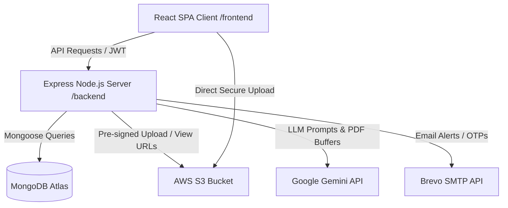

# 🏗️ JobOne — Architectural & Structure Guide

This guide details the design decisions, structural hierarchies, and architectural integrations of the **JobOne** system. It explains how data flows between the user interface, the controller middleware layers, and the persistent MongoDB collection databases.

---

## 🗺️ Architectural Architecture Overview

JobOne follows a decoupled client-server architecture. The system is split into:
1. **Frontend (`/frontend`):** A single-page React client styled with Tailwind CSS (v4) and animated using Framer Motion. 
2. **Backend (`/backend`):** A RESTful Express Node server that connects to MongoDB Atlas and implements various third-party APIs (AWS S3, Google Gemini, Brevo API).

---

## 🗄️ Database Schemas & Models (`/backend/models`)

The system relies on four primary collections representing data flows:

### 1. Candidates (`users.js`)
* **Core Info:** Name, email, hashed password, phone, gender, profile picture.
* **Professional Profile:** Array lists of `skills`, `education`, `experience`, `projects`, `certifications`, and `volunteering`.
* **AI locker (`resumeData`):** A parsed structural schema copy designed to mirror the JSON outputs generated by the Gemini model upon resume parsing.
* **AWS S3 Key (`resumeFileKey`):** Store key location pointers (e.g. `resumes/applicant-xyz-1234.pdf`) instead of raw database binary storage.

### 2. Recruiters (`employer.js`)
* **Organizational Types:** Flags for `company` or `individual`.
* **Business Details:** Nature of business (Proprietorship, Partnership, Private LTD, etc.), website, and address coordinates.
* **ATS Document Verification:** Document file keys stored on S3 for regulatory verification (AADHAR, PAN, GST Forms, Trade Licenses).
* **System Badges:** Approval states (`pending`, `approved`, `rejected`) and freeze indicators.

### 3. Open Roles (`jobs.js`)
* **Categorization:** Strict enum industries (IT & Software, Banking & Finance, Sales & Marketing, Healthcare & Pharma, etc.) and custom subdomains.
* **Metadata & Shifts:** Strict requirements regarding shift limits, work-days, location coordinate indices (`2dsphere` index for location proximity query matches), salary packages, gender choices, and age restrictions.
* **Applicant Log:** References to `User` IDs representing applied candidates.

### 4. Job Applications (`applications.js`)
* **Mapping:** Connects candidate (`appliedBy`) to job opening (`job_id`) and employer (`jobHost`).
* **ATS Workflow Statuses:** Enum fields (`applied`, `shortlisted`, `Interview Scheduled`, `Interview Conducted`, `Assignment Scheduled`, `hired`, `NCTT`).
* **Interactive ATS Tools:** Custom meeting links, reschedule request configurations, and candidate screening answers.

---

## ⚡ Data Flow Patterns

### 1. Secure Document Upload (Resume / Business Documents)
To support file storage, the system implements **Pre-signed S3 URLs** preventing file exposure:
1. **Request URL:** Client requests a signed upload URL via `/user/generate-upload-url` or `/employer/generate-upload-url`.
2. **Key Generation:** Backend generates a random cryptographically secure key and issues a limited-lifetime (10 min) S3 PUT URL.
3. **Upload File:** The client uploads the binary document directly to the S3 bucket using the provided pre-signed URL, keeping backend server memory free.
4. **Link Record:** Client registers the S3 key back to the database (`/save-resume-key` or `/save-document-key`).
5. **View Document:** When viewing a resume, recruiters get a short-lived (1 hr) pre-signed GET URL via `/getViewableResumeUrl`.

### 2. AI Resume Parsing (ATS Flow)
1. **Upload:** Candidate uploads a resume file.
2. **Buffer Stream:** Express routes the multipart data using `multer.memoryStorage()`.
3. **LLM Analysis:**
   * **PDF:** Backend sends the base64-encoded file directly to `gemini-2.5-flash` along with a structured parsing JSON system prompt.
   * **Word Documents (.docx):** Backend extracts text contents via `mammoth` first, then sends the raw text content to Gemini.
4. **Ingestion:** Gemini returns structured JSON mapping candidate skills, education, projects, etc.
5. **Database Update:** The backend saves the structured object directly to the database user record `resumeData`.

### 3. Smart Recommendations
1. **Trigger:** Candidate navigates to the "Recommended Jobs" tab.
2. **Database Query:** Backend retrieves candidates' skills from their profiles or parsed resumes and runs a lightweight Mongo search to fetch active jobs matching the skills.
3. **AI Ranking:** Fetch results, format details, and feed both the candidate data and job details to `gemini-2.5-flash`.
4. **Response:** The AI ranks the jobs, scores them, writes custom match reasoning, and returns them to the frontend.

---

## 🎨 Frontend UI Architecture (`/frontend/src`)

The client layout comprises modular pages and helper wrappers:

* **Entry point (`App.jsx`):** Configures routing tables and embeds the global `GlobalNotificationPopup` and `ChatWidget` helpers that persist across the entire site.
* **Component System (`/components`):**
  * `LocationPicker.jsx` / `JobsAroundMe.jsx`: Implements geographical location capture and Leaflet maps matching job coordinates.
  * `ChatWidgets.jsx`: Implements the Vercel AI stream client, allowing conversational queries with custom server-side database tool execution.
  * `SkillSuggestionsDropdown.jsx` / `CourseSuggestionsDropdown.jsx`: Custom UI dropdown search widgets.
* **Page Hierarchy (`/pages`):**
  * **Candidate Pages:** Dashboard, Profile details, Multi-step application page, Custom job category selectors.
  * **Employer Pages:** Dashboard, Multi-stage job creation page (`CreateJob`), Candidate Search filters, Document uploads page, Candidate tracker.
  * **Admin Pages:** Central control panel (`AdminDashboard`) with user, job, and document moderation options.
