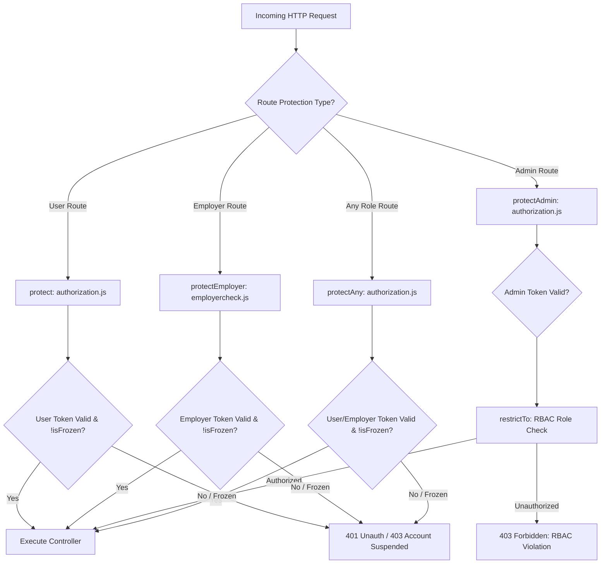
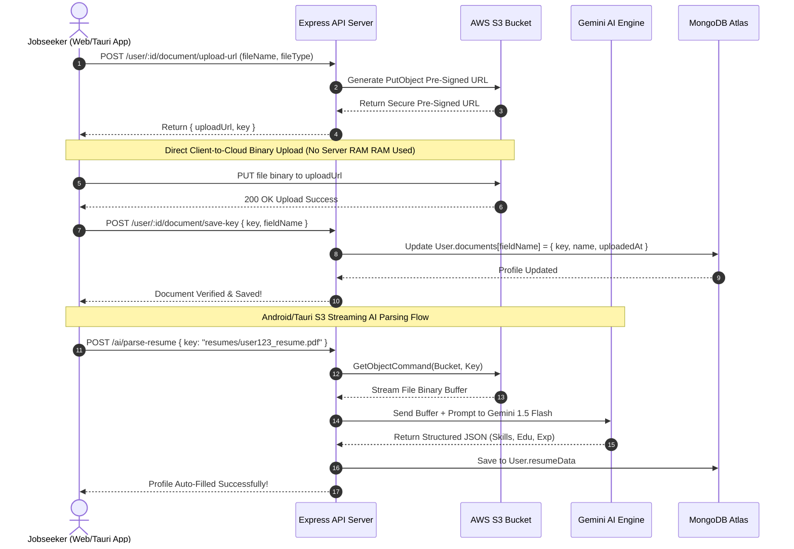
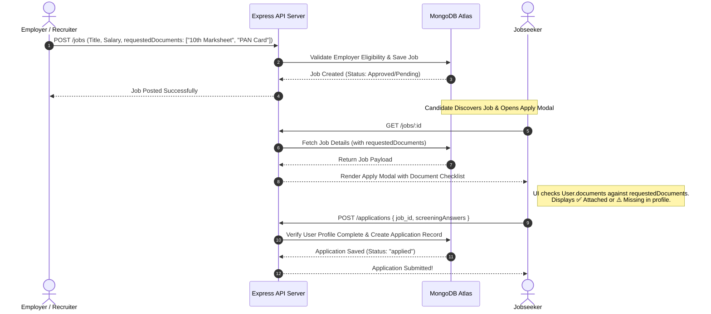
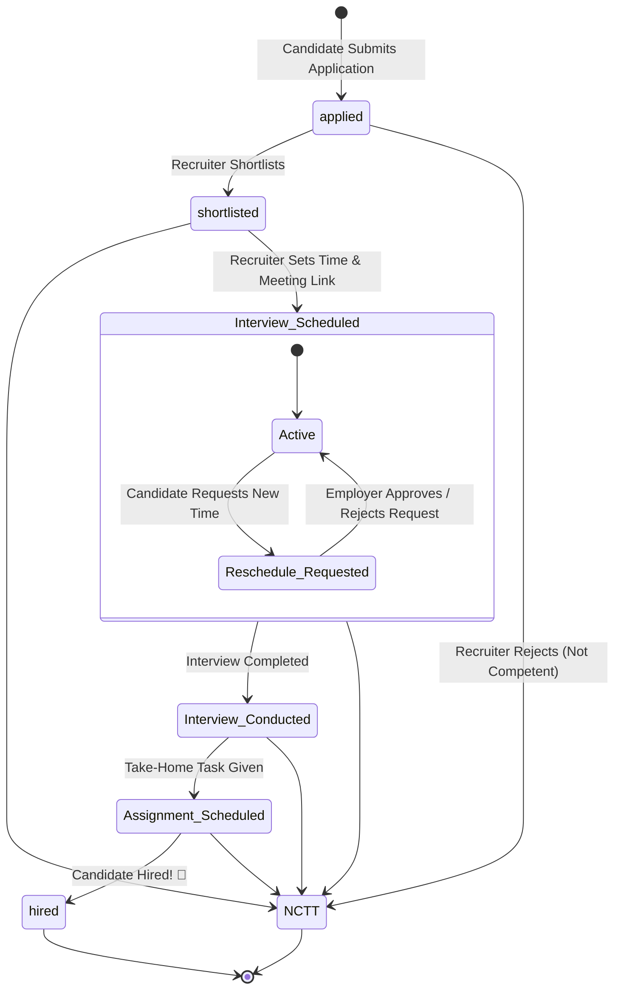
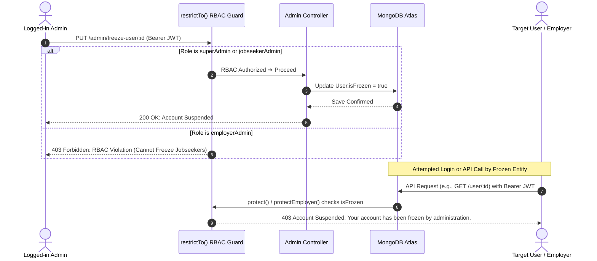

# 🚀 JobOne ATS — Backend Architecture & Technical Documentation

Welcome to the definitive backend documentation for **JobOne ATS** (Applicant Tracking System). This document provides an exhaustive, production-grade architectural breakdown of the backend ecosystem, covering every directory, file, database model, API router, controller logic, middleware guard, external integration, and end-to-end logical workflow.

---

## 📖 1. Executive Summary & System Overview

JobOne ATS is a modern, full-stack recruitment and talent acquisition platform designed to bridge the gap between jobseekers and employers through intelligent automation, rigorous verification, and seamless communication. 

The backend is engineered using **Node.js** and **Express.js**, adhering to a modular, scalable **Model-View-Controller (MVC)** architectural pattern. It features multi-tiered Role-Based Access Control (RBAC), geospatial job matching, AI-powered resume parsing and job recommendations, AWS S3 cloud storage streaming, Brevo SMTP transactional email delivery, and Excel-based system reporting.

---

## 🛠️ 2. Technology Stack & Key Dependencies

| Technology / Library | Version | Architecture Role |
| :--- | :--- | :--- |
| **Node.js / Express.js** | `^5.1.0` | Core asynchronous HTTP REST API server framework. |
| **MongoDB / Mongoose** | `^8.18.2` | NoSQL database ODM with strict schema validation and GIS indexing. |
| **JSON Web Token (JWT)** | `^9.0.2` | Stateless, cryptographic bearer token authentication and session management. |
| **Bcrypt** | `^6.0.0` | 10-round salted password hashing for user, employer, and admin credentials. |
| **AWS SDK S3** | `^3.932.0` | Cloud object storage client and pre-signed URL generator for secure file transfers. |
| **Google Generative AI / AI SDK** | `^0.24.1` / `^3.0.75` | Gemini LLM integration for resume parsing, job description generation, and AI chatbot. |
| **Brevo (Axios SMTP API)** | `^1.13.2` | Transactional email delivery engine for OTP verification and platform alerts. |
| **Multer / PDF-Parse / Mammoth** | `^2.1.1` | In-memory multipart file handling, PDF extraction, and DOCX document processing. |
| **XLSX / Archiver** | `^0.18.5` | Dynamic Excel spreadsheet data export and ZIP archiving for Super Admins. |
| **Express-Validator / Zod** | `^7.3.0` / `^4.4.3` | Rigorous API request body validation and runtime type checking. |

---

## 📁 3. Complete Backend Directory & File Structure

```text
c:\AdoreJob1\backend\
├── configs/
│   └── db.js                        # MongoDB Mongoose connection pool & initialization
├── controllers/
│   ├── adminControllers.js          # Super Admin RBAC, review workflows, freezing & Excel exports
│   ├── aiChatControllers.js         # AI Chatbot conversational assistant endpoints
│   ├── aiControllers.js             # Gemini AI resume parsing (Buffer & S3 stream), job gen & recommendations
│   ├── applicationControllers.js    # 7-stage application lifecycle & interview reschedule workflows
│   ├── contactControllers.js        # Contact Us support ticket ingestion & retrieval
│   ├── employerControllers.js       # Employer onboarding, eligibility, S3 docs, candidate search & profile
│   ├── imageControllers.js          # Dynamic local image asset server
│   ├── jobsControllers.js           # Job CRUD, GIS nearby search, similar jobs & employer metrics
│   └── userControllers.js           # Jobseeker auth, profile, S3 resumes, and 9 optional verification docs
├── middleware/
│   ├── auditlogger.js               # User and employer action logging middleware
│   ├── authorization.js             # JWT bearer verification, operational freeze check, RBAC restrictTo & protectAny
│   ├── constants.js                 # Global HTTP status code constants
│   ├── employercheck.js             # Employer-specific JWT verification and account freeze guard
│   └── errorhandler.js              # Centralized Express error interceptor and JSON formatter
├── models/
│   ├── activity.js                  # Audit trail schema for user/employer actions
│   ├── admin.js                     # Admin credentials with strict RBAC enum (superAdmin, employerAdmin, jobseekerAdmin)
│   ├── applications.js              # Application tracking schema with 7 statuses, screening answers & rescheduling
│   ├── contacted.js                 # Support ticket schema (feedback, complaint, suggestion, inquiry)
│   ├── employer.js                  # Employer profile, business verification docs, GIS location & ratings
│   ├── jobs.js                      # Job posting schema with 9 industry enums, GIS location & requested documents
│   ├── users.js                     # Jobseeker profile, 9 optional verification docs, AI resume data & portfolios
│   ├── userVerification.js          # OTP verification record table for jobseekers
│   └── verification.js              # OTP verification record table for employers
├── routes/
│   ├── adminRoutes.js               # Protected REST routes for admin governance & exports
│   ├── aiRoutes.js                  # Protected REST routes for AI parsing, generation, and chatbot
│   ├── applicationRoutes.js         # REST routes for submitting and managing job applications
│   ├── contactRoutes.js             # REST routes for support contact inquiries
│   ├── employerRoutes.js            # REST routes for employer authentication, profiles, and candidate search
│   ├── imageRoutes.js               # REST route for serving static/dynamic images
│   ├── jobsRoutes.js                # REST routes for job discovery, filtering, and employer metrics
│   └── userRoutes.js                # REST routes for jobseeker auth, profiles, and document management
├── scripts/
│   └── createSuperAdmin.js          # CLI script to seed initial Super Admin credentials in MongoDB
├── utils/
│   ├── activitytrigger.js           # Helper utility for emitting user activity audit events
│   ├── emailVerification.js         # HTML email template generator for OTP verification
│   └── sendEmail.js                 # Axios-based Brevo SMTP REST API transmitter
├── .env                             # Environment variables (DB URI, JWT Secret, Brevo API, AWS S3 keys)
├── check_user.js                    # CLI diagnostic tool for verifying user account state
├── index.js                         # Application entry point, CORS configuration, route mounting & server listen
├── unfreeze_user.js                 # CLI utility for emergency account unfreezing
└── package.json                     # Project dependency manifests and npm scripts
```

---

## 🗄️ 4. Database Schema & Data Models (`/models`)

The data layer is built on MongoDB using Mongoose ODM, utilizing strict schema validation, references (`ObjectId`), and geospatial indices.

### `users.js` (Jobseeker Model)
*   **Core Identity**: `name`, `email` (unique), `password` (hashed), `phone` (unique, sparse), `gender`, `isVerified`, `isProfileComplete`.
*   **Verification Documents (`documents` object)**: Supports 9 optional verification document records, each containing an AWS S3 `key`, file `name`, and `uploadedAt` timestamp:
    *   `tenthMarksheet`, `twelfthMarksheet`, `ugMarksheet`, `pgMarksheet`
    *   `aadharCard`, `panCard`, `medicalCertificate`, `salarySlips` (for experienced candidates), `otherDocuments`
*   **Professional Credentials**: `skills` (Array of strings), `portfolioLinks` (`platform`, `url`), `experience` (linked to `Job` or custom company/role), `projects` (`title`, `technologies`, `link`, `description`), `certifications` (`name`, `issuer`, `date`), `volunteering`.
*   **AI Parsed Data (`resumeData`)**: Embedded object caching AI-extracted details (`name`, `phone`, `description`, `skills`, `projects`, `certifications`, `experience`, `education`) to enable instant profile autofill.
*   **Legacy & S3 Resume**: `resume` (legacy URL), `resumeFileKey` (AWS S3 object key), `resumeOriginalName`.
*   **Governance & Activity**: `isFrozen` (boolean toggle preventing platform access), `createdJobs`, `appliedJobs`, timestamps.

### `employer.js` (Employer Model)
*   **Core Identity**: `name`, `email` (unique), `password`, `phone`, `companyName`, `companyWebsite`, `description`, `profilePicture`.
*   **Business Classification**: `employerType` (`company` vs `individual`), `natureOfBusiness` (`Proprietorship`, `Partnership`, `Trust/NGO`, `Public LTD`, `Private LTD`, `LLP`, `ERP`).
*   **Geospatial Location (`officeLocation`)**: GeoJSON point schema (`type: 'Point'`, `coordinates: [longitude, latitude]`, `address`) enabling location-based candidate search.
*   **Verification Documents**: S3 keys for `aadharCard`, `panCard`, `gstForm`, `otherBusinessCertificate`, `tradeLicense`, `educationDocuments`.
*   **Governance & Status**: `isVerified`, `isApproved` (`pending`, `approved`, `rejected`), `isFrozen`, `ratingsReceived` (embedded review schema with 1-5 star ratings and reviewer IDs).

### `jobs.js` (Job Posting Model)
*   **Job Classification**: `title`, `industry` (Strict enum: `"IT & Software"`, `"Banking & Finance"`, `"Sales & Marketing"`, `"Healthcare & Pharma"`, `"Engineering & Manufacturing"`, `"Operations & Logistics"`, `"Customer Support"`, `"HR & Admin"`, `"Education & EdTech"`), `subdomain`.
*   **Job Details**: `jobSummary`, `keyResponsibilities`, `jobFeatures`, `jobType` (Array: `"permanent"`, `"internship"`, `"full-time"`, `"freelance"`, etc.), `workDaysPattern` (`Mon to Fri`, `Custom`, etc.).
*   **Geospatial Location**: `location` GeoJSON index (`2dsphere`) for "Jobs Near Me" queries, `pinCode`.
*   **Compensation & Perks**: `salaryMin`, `salaryMax`, `salaryCurrency` (`INR`), `salaryFrequency` (`Month`, `Year`, `Lump-Sum`, etc.), `incentives` (Array).
*   **Applicant Screening & Verification Requirements**:
    *   `screeningQuestions`: Array of custom questions candidates must answer during application.
    *   `requestedDocuments`: Array of document names (e.g., `["10th Marksheet", "Aadhar Card", "PAN Card"]`) specifically requested by the employer for this role.
*   **Duration & Scheduling**: `durationType`, `startDate`, `endDate`, `isFlexibleDuration`, `applicationDeadline`, `shifts` (Array of shift names and start/end times).

### `applications.js` (Application Lifecycle Model)
*   **Relational Links**: `job_id` (ref: `Job`), `jobHost` (ref: `Employer`), `appliedBy` (ref: `User`).
*   **Lifecycle Status**: Strict state machine enum:
    *   `applied` ➔ `shortlisted` ➔ `Interview Scheduled` ➔ `Interview Conducted` ➔ `Assignment Scheduled` ➔ `hired` / `NCTT` (Not Competent At This Time).
*   **Screening & Communication**: `screeningAnswers` (Array of `{ question, answer }`), `applicantHasSeen`, `employerMessage`, `meetingLink`, `applicantMessage`.
*   **Interview Reschedule Workflow (`rescheduleRequest`)**: Embedded object tracking candidate reschedule requests (`isRequested`, `reason`, `proposedTime`, `requestStatus`: `"pending"` | `"approved"` | `"rejected"` | `"none"`).

### `admin.js` (RBAC Administration Model)
*   **Identity & Credentials**: `name`, `email` (unique), `password` (hashed via Mongoose `pre('save')` hook).
*   **Strict RBAC Role Enum**:
    *   `superAdmin`: Unrestricted platform access, can manage other admins, export system-wide data, and override all settings.
    *   `employerAdmin`: Restricted to reviewing, approving, auditing, and freezing employers and job postings.
    *   `jobseekerAdmin`: Restricted to reviewing, auditing, and freezing jobseeker accounts and applications.

### Additional Auxiliary Models
*   **`contacted.js`**: Ingests user/employer support inquiries (`communicationType`: `feedback`, `complaint`, `suggestion`, `inquiry`, `isRead` toggle).
*   **`activity.js`**: Audit trail logging actions (`apply`, `message`, `viewProfile`, `login`) linked to user and target IDs.
*   **`userVerification.js` / `verification.js`**: Short-lived OTP verification tables with email binding and expiration timestamps.

---

## 🔐 5. Middleware Layer (`/middleware`)

The middleware layer acts as the security and operational gatekeeper for all HTTP requests entering the Express application.



1.  **`authorization.js`**:
    *   **`protect`**: Extracts Bearer JWT, decodes user ID, verifies user existence in MongoDB, and enforces the **Operational Freeze Guard** (`if (req.user.isFrozen) return 403 Account Suspended`).
    *   **`protectAdmin`**: Verifies admin JWT token and attaches `req.admin`.
    *   **`restrictTo(...roles)`**: Higher-order RBAC middleware. Checks if `req.admin.role` is included in the allowed roles array; rejects with `403 Forbidden` if unauthorized.
    *   **`protectAny`**: Dual-entity authentication guard. Attempts to resolve the JWT against `User` first, and if not found, checks `Employer`. Protects shared endpoints (e.g., viewing public profiles or resumes) while enforcing freeze locks on both entity types.
2.  **`employercheck.js` (`protectEmployer`)**:
    *   Dedicated verification for employer routes. Decodes `req.employerId`, verifies against MongoDB, and strictly blocks frozen employers from posting jobs or accessing applicant pools.
3.  **`errorhandler.js`**:
    *   Centralized Express error interceptor mounted at the end of `index.js`. Captures unhandled exceptions, Mongoose validation errors, and custom API faults, returning standardized JSON payloads (`{ message, stack }` in development).
4.  **`auditlogger.js`**:
    *   Intercepts requests to log user and employer activities into the `Activity` collection for security auditing and platform analytics.

---

## 🛣️ 6. API Routing Layer (`/routes`)

All endpoints are prefixed and mounted in `index.js` with comprehensive CORS support.

| Route Module | Base Path | Key Endpoints & Responsibilities |
| :--- | :--- | :--- |
| **`userRoutes.js`** | `/user` | `POST /register`, `POST /login`, `POST /verifyotp`, `POST /google-login`, `PATCH /:id` (profile update), `POST /:id/resume/upload-url`, `POST /:id/document/upload-url`, `GET /:id/document/download`. |
| **`employerRoutes.js`** | `/employer` | `POST /register`, `POST /login`, `POST /updateProfile`, `GET /profile/:id`, `GET /explore`, `POST /generate-upload-url`, `PATCH /save-document-key`, `GET /my-candidates`. |
| **`jobsRoutes.js`** | `/jobs` | `POST /` (create job), `GET /` (list/filter jobs), `GET /nearby` (GIS search), `GET /category-counts`, `GET /employer-jobs`, `GET /:id/applicants`, `PATCH /:id`. |
| **`applicationRoutes.js`** | `/applications` | `POST /` (apply), `GET /:id` (user apps), `GET /job/:jobId` (employer applicants), `PATCH /:id/status` (7-stage update), `POST /:id/reschedule` (reschedule request). |
| **`adminRoutes.js`** | `/admin` | `POST /login`, `POST /create-admin` (Super Admin only), `GET /employers/pending`, `PATCH /employers/:id/review`, `PUT /freeze-user/:id`, `GET /export/all`. |
| **`aiRoutes.js`** | `/ai` | `POST /parse-resume` (Buffer/S3 stream), `POST /generate-job-details`, `GET /recommend-jobs`, `POST /chat` (Gemini chatbot). |
| **`contactRoutes.js`** | `/contact` | `POST /` (submit support inquiry), `GET /:id` (admin review). |
| **`imageRoutes.js`** | `/images` | `GET /:folder/:filename` (serves local profile/company assets). |

---

## ⚙️ 7. Controllers & Logical Workflows (`/controllers`)

### 7.1 User / Jobseeker Management (`userControllers.js`)
*   **Authentication & Onboarding**: Implements secure registration (`createUser`) with Bcrypt hashing and 6-digit Brevo OTP email generation. Supports Google OAuth (`googleLogin`) by validating ID tokens and auto-provisioning user profiles.
*   **AWS S3 Pre-Signed Document Pipeline**:
    *   To prevent server RAM exhaustion from large binary file uploads, the controller implements a 3-step S3 pre-signed URL pattern for resumes, profile pictures, and the **9 verification documents**.
    *   `getJobseekerDocumentUploadUrl`: Generates a secure PUT pre-signed URL for AWS S3 (`jobseeker-documents/${userId}/${fieldName}_${timestamp}.${ext}`).
    *   `saveJobseekerDocumentKey`: Updates the user's MongoDB profile with the uploaded file's S3 object key.
    *   `getDownloadableJobseekerDocumentUrl`: Generates an AWS S3 GET pre-signed URL with the `ResponseContentDisposition` header set to force a clean file download with a human-readable filename (e.g., `John_Doe_10th_Marksheet.pdf`).
    *   `deleteJobseekerDocument`: Uses `DeleteObjectCommand` to scrub files from S3 and removes the reference from MongoDB.

### 7.2 Employer Management (`employerControllers.js`)
*   **Business Verification & Eligibility**: Handles employer onboarding and OTP verification. Implements `checkEmployerEligibility`, which verifies if an employer has completed their profile and uploaded required business documents (PAN, GST, Trade License) before allowing them to publish job postings.
*   **Candidate Search Engine (`searchCandidatesBySkills`)**: Performs MongoDB aggregation queries across user profiles, matching required skills and filtering out frozen accounts to present recruiters with qualified candidate pools.

### 7.3 Job Postings & Discovery (`jobsControllers.js`)
*   **Job Creation & Document Checklists**: In `createJob`, employers specify job details along with `requestedDocuments` (an array of required document names). This checklist is stored in the Job document to inform candidates what credentials are required.
*   **Geospatial Nearby Search (`getNearbyJobs`)**: Utilizes MongoDB's `$near` and `$geometry` operators on the `2dsphere` index of `location.coordinates`, calculating precise distances in meters to return jobs within a candidate's radius.
*   **Analytics & Metrics (`getEmployerMetrics`)**: Aggregates total jobs created, active listings, total applications received, and shortlisted candidate counts for employer dashboards.

### 7.4 Application Lifecycle & Scheduling (`applicationControllers.js`)
*   **Application Submission (`createApplication`)**: Validates that candidate profile is complete and not already applied. Stores custom `screeningAnswers` submitted by the candidate.
*   **7-Stage State Machine (`updateApplicationStatus`)**: Recruits transition applications through 7 distinct stages:
    *   `applied` ➔ `shortlisted` ➔ `Interview Scheduled` (requires meeting link and time) ➔ `Interview Conducted` ➔ `Assignment Scheduled` ➔ `hired` or `NCTT`.
*   **Interview Reschedule Workflow**:
    *   `requestInterviewReschedule`: Allows candidates to request an interview time change by submitting a `reason` and `proposedTime`, setting `rescheduleRequest.requestStatus = "pending"`.
    *   `respondToRescheduleRequest`: Employers approve or reject the request, automatically updating meeting details and alerting the candidate.

### 7.5 AI & Intelligent Automation (`aiControllers.js` & `aiChatControllers.js`)
*   **Dual-Input AI Resume Parsing (`parseResume`)**:
    *   Utilizes `@google/generative-ai` (Gemini 1.5 Flash) to extract structured JSON data from resumes (`name`, `email`, `phone`, `skills`, `projects`, `experience`, `certifications`).
    *   **Mobile Android/Tauri S3 Streaming Support**: To overcome mobile webview `FormData` binary upload limitations, the controller accepts either a `req.file` buffer OR a JSON payload containing an S3 `{ key }`. When a key is provided, the backend uses AWS SDK `GetObjectCommand` to stream the resume binary directly from S3 into memory, parsing it seamlessly!
*   **Automated Job Description Generator (`generateJobDetails`)**: Takes basic employer inputs (title, industry, experience) and prompts Gemini AI to generate professional job summaries, key responsibilities, and required skill arrays.
*   **AI Job Recommendation Engine (`recommendJobs`)**: Compares candidate profile skills and experience against active job postings, scoring and ranking job matches automatically.
*   **Conversational Assistant (`aiChatControllers.js`)**: Interfaces with `@ai-sdk/google` to power the real-time JobOne support chatbot.

### 7.6 Super Admin Governance & Exports (`adminControllers.js`)
*   **Strict RBAC Freezing (`freezeUser` / `freezeEmployer`)**:
    *   Enforces domain-isolated account suspension. An `employerAdmin` is programmatically blocked from freezing jobseekers, and a `jobseekerAdmin` is blocked from freezing employers. `superAdmin` retains universal control.
*   **Excel Data Export Engine (`exportDataToExcel`)**:
    *   Uses the `xlsx` library to query MongoDB collections, format data cleanly into worksheets (Admins, Employers, Jobseekers, Jobs, Applications), and generate multi-tab `.xlsx` binary buffers streamed directly to the admin's browser.
*   **Verification Approvals (`reviewEmployer` / `reviewJob`)**: Admins review business documents and job postings, toggling status between `pending`, `approved`, and `rejected`.

---

## 📦 8. External Integrations & Utilities (`/utils` & `/configs`)

### Database Connection (`configs/db.js`)
```javascript
import mongoose from "mongoose";
const connectDB = async () => {
  try {
    const conn = await mongoose.connect(process.env.MONGO_URI);
    console.log(`MongoDB Connected: ${conn.connection.host}`);
  } catch (error) {
    console.error(`Error: ${error.message}`);
    process.exit(1);
  }
};
export default connectDB;
```

### Transactional Email Engine (`utils/sendEmail.js` & `emailVerification.js`)
*   Instead of standard SMTP libraries that can be blocked by firewalls, JobOne utilizes **Brevo's REST SMTP API** via Axios (`https://api.brevo.com/v3/smtp/email`).
*   `emailVerification.js` dynamically compiles responsive, branded HTML email templates containing 6-digit verification OTPs, company logos, and security warnings.

---

## 🔄 9. Core Application Logical Workflows

### Workflow A: Secure S3 Document & Resume Upload Pipeline (Web & Mobile Android/Tauri)
This workflow highlights how candidates safely upload resumes and verification documents without overloading server memory, and how AI parsing supports mobile builds.



---

### Workflow B: Job Creation, Employer Requirements & Candidate Application Flow
This workflow demonstrates how employers request specific verification documents and how candidates satisfy them during application.



---

### Workflow C: 7-Stage Interview & Rescheduling Lifecycle
This workflow maps the lifecycle of a job application from initial screening to interview scheduling and candidate rescheduling requests.



---

### Workflow D: Strict RBAC Admin Governance & Operational Freeze System
This workflow illustrates the multi-tiered admin authorization guards and how account freezing isolates entities.



---

## 🎯 Conclusion

The **JobOne ATS Backend** is structured for maximum resilience, security, and developer ergonomics. With clean separation of concerns across MVC layers, rigorous JWT and RBAC guards, cloud-native S3 file streaming, and intelligent Gemini AI integrations, the system is fully equipped to handle high-volume talent acquisition workflows reliably.
