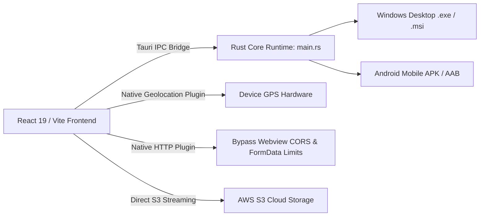
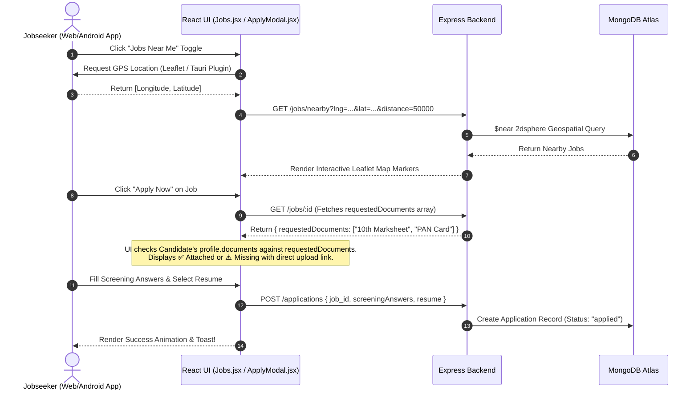
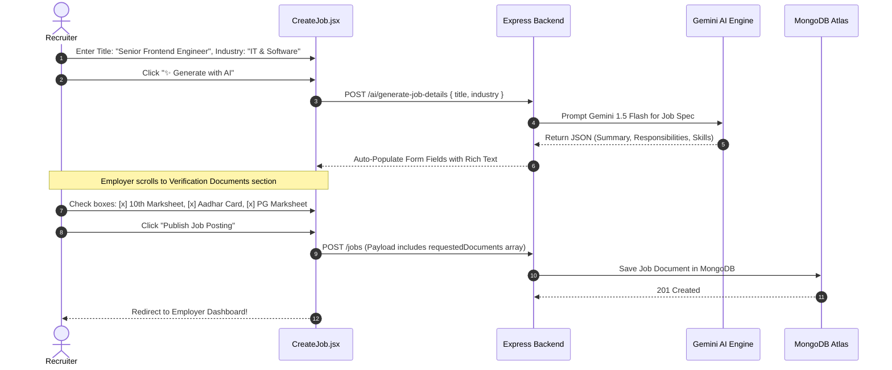
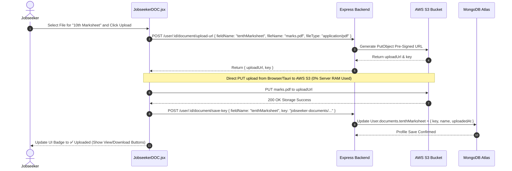
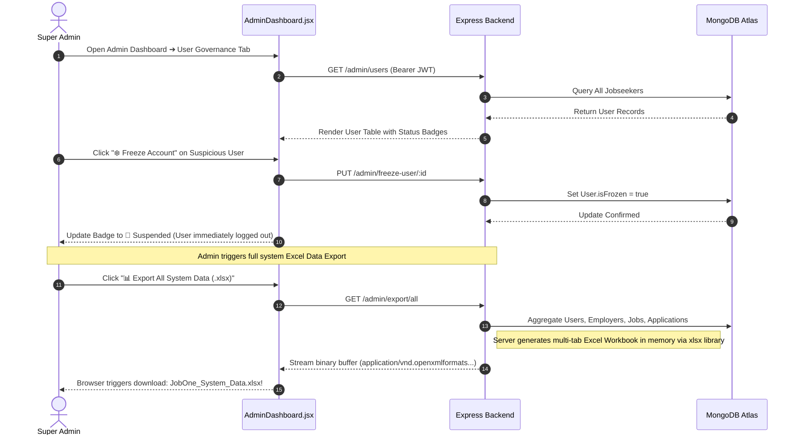

# 🎨 JobOne ATS — Frontend & Desktop/Mobile Application Technical Documentation

Welcome to the definitive frontend and client-side technical documentation for **JobOne ATS** (Applicant Tracking System). This document provides an exhaustive, production-grade architectural breakdown of our modern user interface ecosystem, detailing every directory, file, React component, page module, state management pattern, Tauri desktop/mobile integration, and end-to-end user workflow.

---

## 📖 1. Executive Summary & Architecture Overview

The JobOne ATS client application is an advanced, responsive **Single Page Application (SPA)** engineered to deliver an exceptional, premium user experience across desktop browsers, native Windows desktop executables, and native **Android mobile applications (APK/AAB)**.

Built on **React 19** and bundled with **Vite 7**, the frontend leverages **Tailwind CSS v4** and **Framer Motion v12** for dynamic styling, glassmorphism aesthetics, micro-animations, and fluid transitions. It integrates real-time geospatial mapping via Leaflet, Google OAuth 2.0 authentication, Gemini AI conversational assistance and resume parsing, AWS S3 direct cloud file streaming, and multi-role dashboards tailored for Jobseekers, Employers, and Super Admins.

---

## 🛠️ 2. Technology Stack & Key Dependencies

| Technology / Library | Version | Architecture Role |
| :--- | :--- | :--- |
| **React / React DOM** | `^19.1.1` | Modern component-based UI rendering engine utilizing hooks and concurrent rendering. |
| **Vite** | `^7.1.7` | Next-generation frontend bundler with instant HMR and optimized Rollup chunking. |
| **Tailwind CSS** | `^4.1.13` | Utility-first CSS styling framework with modern color palettes and responsive design tokens. |
| **Framer Motion** | `^12.23.24` | Animation library powering UI page transitions, bento grids, and interactive modal popups. |
| **React Router DOM** | `^7.9.3` | Client-side routing framework managing protected role-based layouts and deep linking. |
| **Tauri CLI & API** | `^2.11.4` / `^2.11.1` | Cross-platform Rust runtime compiling web assets into native Windows and Android mobile apps. |
| **Leaflet / React-Leaflet** | `^1.9.4` / `^5.0.0` | Geospatial GIS mapping engine powering interactive coordinates selection and nearby jobs radar. |
| **Axios** | `^1.12.2` | HTTP client handling REST API communication, JWT bearer token attachment, and error interception. |
| **Lucide React / React Icons** | `^0.552.0` / `^5.5.0` | High-quality, scalable iconography used across navigation bars, badges, and dashboard cards. |
| **AI SDK React / Gemini AI** | `^3.0.198` / `^6.0.196` | Hooks and streaming UI components for the live JobOne support chatbot and AI assistants. |
| **React OAuth Google** | `^0.13.4` | Google Identity Services wrapper enabling one-click OAuth login for candidates and employers. |
| **Swiper** | `^12.0.2` | Touch-enabled slider library powering featured company carousels and testimonials. |

---

## 📁 3. Complete Frontend Directory & File Structure

```text
c:\AdoreJob1\frontend\
├── public/                          # Static public assets (favicons, logos, default avatars)
├── src/
│   ├── assets/                      # Bundled media assets (images, hero background videos)
│   ├── components/                  # 32 reusable UI components, modals, bento grids & map widgets
│   │   ├── ApplicationDetailsModal.jsx  # Recruiter review modal (resume download & screening answers)
│   │   ├── ApplyModal.jsx               # Interactive job application wizard with document verification checklist
│   │   ├── BackgroundJoin.jsx           # Animated decorative background for onboarding CTA
│   │   ├── CTA.jsx                      # Call-to-action banner section for landing pages
│   │   ├── ChatWidgets.jsx              # Floating Gemini AI chatbot support widget (@ai-sdk/react)
│   │   ├── CompanyCard.jsx              # Employer showcase card displaying open jobs & ratings
│   │   ├── CompanyDisplay.jsx           # Compact company badge snippet
│   │   ├── CourseSuggestionsDropdown.jsx # Searchable course recommendations autocomplete
│   │   ├── ElasticTitleDropdown.jsx     # Searchable animated job title selector
│   │   ├── EmployerProtectedRoute.jsx   # Role-based route guard strictly for verified employers
│   │   ├── FeaturedJobs.jsx             # Carousel component highlighting premium job postings
│   │   ├── Footer.jsx                   # Comprehensive navigation footer with links and social icons
│   │   ├── GlobalNotificationPopup.jsx  # System-wide alert and notification toast manager
│   │   ├── Hero.jsx                     # Dynamic landing page hero banner with search bar & stats
│   │   ├── JobCategories.jsx            # Bento grid showcasing the 9 core industry domains
│   │   ├── JobConfirmModal.jsx          # Preview verification modal before employer publishes a job
│   │   ├── JobDetailsModal.jsx          # Comprehensive job viewer modal with tabs and apply trigger
│   │   ├── JobPreviewCard.jsx           # Job listing card displaying salary, shift, skills, and tags
│   │   ├── JobsAroundMe.jsx             # Leaflet GIS map displaying nearby jobs based on user coordinates
│   │   ├── LanguageSuggestionsDropdown.jsx # Autocomplete language skill selector
│   │   ├── LiveTicker.jsx               # Real-time scrolling ticker showing platform hiring activity
│   │   ├── LocationPicker.jsx           # Interactive Leaflet map geocoder for selecting office coordinates
│   │   ├── LogoJobOne.jsx               # SVG branded logo component
│   │   ├── MobileHeroBg.jsx             # Optimized background graphic for mobile viewports
│   │   ├── NavBar.jsx                   # Responsive top navigation bar with dynamic role switching
│   │   ├── NetworkBackground.jsx        # Animated particle network background effect
│   │   ├── ProcessBento.jsx             # Step-by-step onboarding bento grid layout
│   │   ├── ProtectedRoute.jsx           # Role-based route guard strictly for jobseekers
│   │   ├── RecommendedJobs.jsx          # AI-matched job recommendation listing widget
│   │   ├── SkillSuggestionsDropdown.jsx # Autocomplete skill selector linked to skillsByTitle.js
│   │   ├── Testimonials.jsx             # Swiper carousel featuring user and recruiter reviews
│   │   └── VideoSection.jsx             # High-impact video showcase section
│   ├── data/
│   │   └── skillsByTitle.js             # Comprehensive taxonomy mapping job titles to standard skill sets
│   ├── pages/                       # 44 page modules covering public, candidate, employer, and admin journeys
│   │   ├── About.jsx                    # Platform mission and about us page
│   │   ├── AdminDashboard.jsx           # Super Admin multi-tab portal (metrics, freezing, Excel exports)
│   │   ├── AdminJobseekerView.jsx       # Admin inspection view for specific jobseeker profiles
│   │   ├── AdminLogin.jsx               # Dedicated administrative authentication portal
│   │   ├── ApplicantDetails.jsx         # Full-page applicant review screen for recruiters
│   │   ├── Applicants.jsx               # Master list of all applicants across employer's jobs
│   │   ├── ApplyPage.jsx                # Standalone application submission page
│   │   ├── CompanyProfile.jsx           # Public employer profile page with open roles and ratings
│   │   ├── Contact.jsx                  # Contact Us support inquiry submission form
│   │   ├── CreateJob.jsx                # 9-step job posting wizard with AI description gen & doc checklists
│   │   ├── EditJob1.jsx                 # Job modification wizard with document verification checklists
│   │   ├── EditProfile.jsx              # Jobseeker profile editor (basic info, skills, experience)
│   │   ├── EditProfile2.jsx             # Multi-tab resume uploader with Gemini AI autofill trigger
│   │   ├── EmployerAdminView.jsx        # Admin inspection view for employer business documents
│   │   ├── EmployerCandidateSearch.jsx  # Skill-based candidate sourcing engine for recruiters
│   │   ├── EmployerDOC.css              # Styling sheet for employer document upload interfaces
│   │   ├── EmployerDOC.jsx              # Standalone employer document upload portal
│   │   ├── EmployerDashboard.jsx        # Recruiter analytics hub (jobs created, active applicants)
│   │   ├── EmployerEditProfile.jsx      # Employer profile editor (company info, website, GIS location)
│   │   ├── EmployerEditProfile2.jsx     # Business verification document uploader (PAN/GST/Trade License)
│   │   ├── EmployerJobDetails.jsx       # Detailed view of an employer's posted job and analytics
│   │   ├── EmployerMyCandidates.jsx     # Shortlisted and saved candidates pipeline
│   │   ├── EmployerOTP.jsx              # 6-digit Brevo OTP verification screen for employers
│   │   ├── EmployerProfile.jsx          # Recruiter's internal view of their company profile
│   │   ├── EmployerRegister.jsx         # Employer account registration form
│   │   ├── EmployerRegisterOption.jsx   # Onboarding selector (Company vs Individual recruiter)
│   │   ├── ExploreCompanies.jsx         # Directory and search engine for verified employers
│   │   ├── ForgotPassword.jsx           # Password recovery request and OTP reset portal
│   │   ├── Home.jsx                     # Master landing page assembling Hero, Bento grids, and CTA
│   │   ├── JobAdminView.jsx             # Admin inspection view for reviewing pending job postings
│   │   ├── JobApplicants.jsx            # Applicant pipeline management table for a specific job
│   │   ├── Jobs.jsx                     # Main job discovery dashboard with search, filters, and GIS nearby
│   │   ├── JobseekerDOC.jsx             # Dedicated document vault for 9 optional verification credentials
│   │   ├── Login.jsx                    # Unified login portal for jobseekers and employers
│   │   ├── MyApplications.jsx           # Candidate application tracking dashboard with reschedule forms
│   │   ├── Profile.jsx                  # Jobseeker internal profile summary view
│   │   ├── PublicProfile.jsx            # Shareable candidate profile with downloadable verification docs
│   │   ├── RecommendedJobs.jsx          # Dedicated AI recommendation page for jobseekers
│   │   ├── Register.jsx                 # Initial onboarding role selection screen
│   │   ├── Services.jsx                 # Overview of JobOne recruitment services
│   │   ├── TestLocation.jsx             # Diagnostic page for testing browser/Tauri GPS coordinates
│   │   ├── UserDashboard.jsx            # Candidate hub showing application stats and recommended jobs
│   │   ├── UserOTP.jsx                  # 6-digit Brevo OTP verification screen for jobseekers
│   │   └── UserRegister.jsx             # Candidate account registration form
│   ├── routes/
│   │   └── AuthHome.jsx                 # Routing helper redirecting authenticated users to their dashboards
│   ├── userdashboard/               # Legacy modular components for candidate dashboards
│   │   ├── FeaturedJobs.jsx             # Candidate dashboard featured jobs carousel
│   │   ├── Hero.jsx                     # Candidate dashboard personalized welcome banner
│   │   ├── HeroRain.scss                # Custom SCSS rain animation styling
│   │   └── JobCategories.jsx            # Candidate dashboard quick category filter
│   ├── App.css                      # Global component transition rules and custom utility classes
│   ├── App.jsx                      # Master application router, route guards, and notification state
│   ├── index.css                    # Tailwind CSS v4 directives and base design system tokens
│   └── main.jsx                     # React 19 root renderer wrapped with Google OAuth provider
├── src-tauri/                       # Tauri v2 desktop & mobile (Android APK/AAB) Rust runtime
│   ├── capabilities/                # Tauri security capability permissions (HTTP, geolocation)
│   ├── gen/android/                 # Android Gradle project generating native mobile builds
│   ├── icons/                       # App bundle icons (32x32, 128x128, .icns, .ico)
│   ├── src/main.rs                  # Rust application entry point and plugin initialization
│   ├── Cargo.toml                   # Rust crate dependencies and build metadata
│   └── tauri.conf.json              # Tauri configuration (window sizing, bundle ID: com.jobone.app)
├── .env                             # Environment variables (API Base URL, Google OAuth Client ID)
├── eslint.config.js                 # ESLint rules enforcing React 19 and hooks best practices
├── index.html                       # Single Page Application HTML root shell and font imports
├── package.json                     # Frontend dependency manifests and build scripts
└── vite.config.js                   # Vite bundler settings, Tauri server hooks, and manual chunking
```

---

## 🧩 4. Component Architecture (`/src/components`)

Our components are engineered for maximum reusability, responsiveness, and visual impact.

### 4.1 Navigation & Layout
*   **`NavBar.jsx`**: A sticky, glassmorphism top bar that adapts dynamically to user authentication state. Features instant role-switching links, profile avatars, notification bell badges, and mobile hamburger menus.
*   **`Footer.jsx`**: A multi-column navigation footer featuring platform directory links, newsletter subscription forms, and social media links.

### 4.2 Job Discovery & Application Wizards
*   **`JobPreviewCard.jsx` & `CompanyCard.jsx`**: High-conversion visual cards displaying job titles, company badges, salary ranges (`INR`), shift timings, work models (`Remote`, `Hybrid`, `On-site`), and skill pills.
*   **`JobDetailsModal.jsx`**: An interactive slide-over modal presenting comprehensive job details, key responsibilities, employer GIS location maps, screening questions preview, and an instant "Apply Now" trigger.
*   **`ApplyModal.jsx` (Interactive Application Wizard)**:
    *   **Document Verification Checklist**: Compares the employer's `requestedDocuments` array against the candidate's uploaded profile credentials. Displays clear badges: `✅ Attached (From Profile)` for matched files, or `⚠️ Requested by Employer (Missing in Profile)` with a direct link to open the document vault!
    *   **Screening Questions**: Renders custom textareas for candidates to answer employer screening questions.
    *   **Resume Selection**: Allows choosing the AI-parsed S3 resume or uploading a fresh document.
*   **`ApplicationDetailsModal.jsx` (Recruiter Review Suite)**: Empowers recruiters to inspect candidate screening answers, view/download S3 resumes, trigger 7-stage status updates (`shortlisted`, `Interview Scheduled`, `hired`, `NCTT`), and approve/reject interview rescheduling requests.

### 4.3 Geospatial GIS & Mapping
*   **`LocationPicker.jsx`**: An interactive Leaflet map integration allowing employers to search addresses via OpenStreetMap geocoding, drop pins, and capture precise `[longitude, latitude]` coordinates for office locations.
*   **`JobsAroundMe.jsx`**: A GIS radar component that requests user device GPS coordinates (via browser API or Tauri mobile geolocation plugin) and displays interactive map markers for nearby job postings.

### 4.4 AI & Dynamic Engagement
*   **`ChatWidgets.jsx`**: A floating AI support assistant built with `@ai-sdk/react` that communicates seamlessly with our backend Gemini AI endpoints to answer user queries in real-time.
*   **`LiveTicker.jsx`**: A continuous scrolling ticker highlighting live platform activity (e.g., *"340 candidates hired this week"*, *"1,200 new IT & Software jobs posted"*).
*   **`ElasticTitleDropdown.jsx` & `SkillSuggestionsDropdown.jsx`**: Animated, searchable dropdowns with keyboard navigation that pull from `skillsByTitle.js` to standardize candidate skill inputs and job titles.

---

## 📄 5. Pages & User Journeys (`/src/pages`)

### 5.1 Public & Guest Journey
*   **`Home.jsx`**: The flagship landing page combining `Hero.jsx`, `LiveTicker.jsx`, `JobCategories.jsx` bento grid, `FeaturedJobs.jsx`, `ProcessBento.jsx`, and `Testimonials.jsx` into a stunning first impression.
*   **`Jobs.jsx`**: The master job discovery hub. Supports keyword search, location filtering, industry dropdowns, salary sliders, and toggling between Grid View and **GIS Map View (`JobsAroundMe`)**.
*   **`ExploreCompanies.jsx` & `CompanyProfile.jsx`**: Dedicated directory allowing candidates to research verified employers, view company descriptions, explore office maps, read 1-5 star employee reviews, and browse open roles.
*   **`PublicProfile.jsx`**: A shareable, professional portfolio page for candidates. Renders skills, experience timelines, projects, certifications, and provides download buttons for verified credentials.

### 5.2 Jobseeker Experience
*   **Onboarding & Auth (`Login.jsx`, `UserRegister.jsx`, `UserOTP.jsx`)**: Seamless 6-digit OTP verification flow with Brevo email integration and one-click Google OAuth login.
*   **`UserDashboard.jsx`**: Personal command center showing application counters (`Applied`, `Shortlisted`, `Interviews`), recent application statuses, and AI-recommended jobs.
*   **`EditProfile2.jsx` (AI Resume Autofill Engine)**: Allows candidates to upload their PDF/DOCX resume. Clicking *"Autofill with AI"* sends the file (or S3 key on mobile) to our Gemini AI endpoint, instantly populating their form fields (name, skills, projects, education, experience) without manual typing!
*   **`MyApplications.jsx` (Application Tracker & Reschedule Portal)**: Displays all submitted applications. If an interview is scheduled, candidates can click *"Request Reschedule"*, input a reason and proposed time, and send it directly to the recruiter.
*   **`JobseekerDOC.jsx` (Verification Document Vault)**:
    *   A dedicated, secure management console for the **9 optional verification credentials** (`10th Marksheet`, `12th Marksheet`, `UG Marksheet`, `PG Marksheet`, `Aadhar Card`, `PAN Card`, `Medical Certificate`, `3 Months Salary Slip`, `Other Documents`).
    *   Implements the **AWS S3 Pre-Signed URL pattern**: Clicking *"Upload"* fetches a direct S3 PUT URL, uploads the file binary from the client browser without touching server RAM, and saves the object key in MongoDB. Provides instant *"View"* and *"Download"* (forcing clean filename headers) buttons.

### 5.3 Employer / Recruiter Experience
*   **`EmployerDashboard.jsx`**: Recruiter analytics hub providing instant metrics on active job postings, total candidate views, and pending application reviews.
*   **`EmployerEditProfile2.jsx` (Business Verification Suite)**: Allows recruiters to upload mandatory business documents (`PAN Card`, `GST Form`, `Trade License`, `Aadhar Card`) to S3 for Admin verification before publishing jobs.
*   **`CreateJob.jsx` (9-Step Job Posting Wizard)**:
    *   **AI Job Details Generator**: Input a title and industry, click *"Generate with AI"*, and watch Gemini craft professional summaries and key responsibilities!
    *   **Verification Document Checklist**: Features an interactive checkbox matrix of all 9 verification documents. Checking items here saves them to `job.requestedDocuments`, mandating that applying candidates provide these credentials.
    *   **Screening Questions**: Allows defining custom questions for candidates to answer.
*   **Candidate Sourcing (`EmployerCandidateSearch.jsx`, `JobApplicants.jsx`)**: Advanced candidate filtering by skills and experience, and a Kanban/table view of applicants per job with 7-stage status update controls.

### 5.4 Super Admin Governance Portal
*   **`AdminDashboard.jsx`**: A comprehensive, multi-tab governance suite protected by strict RBAC:
    *   **Pending Approvals Tab**: Review newly registered employers and job postings, inspecting uploaded business documents before toggling status to `Approved` or `Rejected`.
    *   **User & Employer Governance Tab**: View all registered jobseekers and employers. Features an **Operational Freeze Toggle** (`Freeze Account` / `Unfreeze Account`). Freezing an account instantly revokes their JWT access across the entire platform.
    *   **Data Export Suite**: Features 1-click download buttons that hit backend export endpoints to generate and download comprehensive multi-tab **Excel Spreadsheet Reports (`.xlsx`)** for Admins, Employers, Jobseekers, and Jobs!

---

## 📱 6. Tauri v2 Desktop & Mobile (Android APK/AAB) Integration (`/src-tauri`)

JobOne ATS is not just a web app; it is a cross-platform desktop and mobile application powered by **Tauri v2**.



*   **Configuration (`tauri.conf.json`)**: Configured with unique bundle identifier `com.jobone.app`, pointing `frontendDist` to `../dist`.
*   **Mobile Android Constraints & S3 Streaming Solution**:
    *   In mobile Android webviews (APKs), standard HTML `FormData` file uploads often fail due to strict webview sandbox file path restrictions.
    *   Our architecture solves this by using the **S3 Pre-Signed URL pattern**. The Tauri mobile app uploads binary files directly to AWS S3 via PUT requests. For AI resume parsing, instead of sending the file binary over HTTP, the mobile app sends `{ key: "resumes/user123.pdf" }` to `/ai/parse-resume`, allowing the backend to stream directly from S3!
*   **Native Capabilities (`/capabilities`)**: Configured with permissions for `@tauri-apps/plugin-geolocation` (enabling precise GPS positioning for *"Jobs Near Me"* on Android) and `@tauri-apps/plugin-http`.

---

## ⚡ 7. Build Bundling & Performance Optimization (`vite.config.js`)

To ensure lightning-fast page loads and eliminate large bundle warnings during production builds (`npm run build`), `vite.config.js` implements a custom Rollup manual chunk partitioning strategy:

```javascript
build: {
  rollupOptions: {
    output: {
      manualChunks(id) {
        if (id.includes('node_modules')) {
          if (id.includes('framer-motion')) return 'vendor-framer';
          if (id.includes('react') || id.includes('react-dom') || id.includes('react-router')) return 'vendor-react';
          if (id.includes('lucide-react') || id.includes('react-icons')) return 'vendor-icons';
          return 'vendor';
        }
      }
    }
  }
}
```
This isolates heavy animation and UI libraries into independent cached chunks, keeping the initial HTML payload under 1 KB and ensuring smooth mobile execution.

---

## 🔄 8. Core Frontend Interactive Workflows

### Workflow 1: Candidate Job Search, GIS Nearby Radar & Application with Document Verification Checklist
This workflow maps how candidates discover jobs via GPS and apply with real-time verification checklists.



---

### Workflow 2: Employer Job Creation with AI Assistant & Required Verification Checklists
This workflow illustrates how employers leverage Gemini AI to write job descriptions and mandate document credentials.



---

### Workflow 3: Candidate Document Management Vault (`JobseekerDOC.jsx`) S3 Pre-Signed Upload Lifecycle
This workflow demonstrates the direct client-to-cloud S3 file transfer mechanism used for all 9 verification credentials.



---

### Workflow 4: Admin Governance, Live Metrics & Excel Reporting Portal
This workflow details the Super Admin inspection, account freezing, and spreadsheet data export pipeline.



---

## 🎯 Conclusion

The **JobOne ATS Frontend Ecosystem** represents a pinnacle of modern web and desktop/mobile engineering. By harmonizing React 19, Vite 7, Tailwind CSS v4, Framer Motion v12, and Tauri v2 Rust runtimes with intelligent cloud S3 streaming and Gemini AI automation, the application delivers a blazing-fast, secure, and visually stunning recruitment experience across all platforms.
